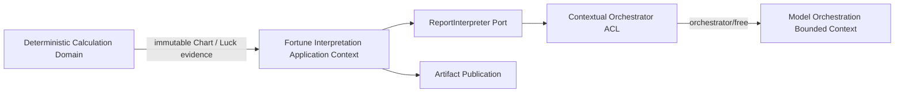
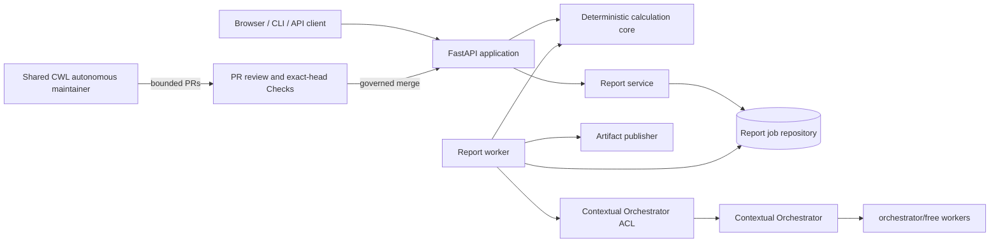

# Four Pillars Architecture

Four Pillars is a deterministic Korean Four Pillars calculation product with a schema-validated interpretation plane. It can run as an independent application service or as a modular MSA component inside ContextualWisdomLab. Model-provider routing is intentionally not part of this product's bounded context.

## Architectural invariants

1. **Deterministic calculation is authoritative.** Calendar conversion, solar terms, pillars, Ten Gods, interactions, luck periods, warnings, and the calculation fingerprint are produced without an LLM.
2. **Interpretation depends on an application port.** `ReportInterpreter` receives immutable evidence and returns a validated generated report.
3. **Provider routing is external.** The repository-owned interpreter is an anti-corruption layer into Contextual Orchestrator, fixed to `orchestrator/free`. Provider discovery, provider credentials, free-pool eligibility, and provider failover belong to the orchestration bounded context.
4. **A model cannot change evidence.** Generated prose is validated against Pydantic schemas and deterministic quality gates.
5. **Ports preserve modularity.** Persistence, interpretation, report history, idempotency, and artifact publishing are structural interfaces.
6. **One writer owns autonomous development.** The repository keeps a model-free quality sentinel while organization-wide model-backed development is coordinated by the shared CWL maintainer loop. Four Pillars does not run a second provider-credentialed coding agent.
7. **Gateway failure is visible.** An unavailable gateway or empty `orchestrator/free` pool never causes direct provider fallback or paid-route escalation.

## DDD context map



Four Pillars owns calculation policy, interpretation use cases, prompts, report schemas, quality rules, and user-facing artifacts. Contextual Orchestrator owns model/provider discovery, routing, provider credentials, free/ZDR policy, usage attribution, and test-time compute allocation. The ACL prevents those infrastructure concepts from becoming domain objects.

## Mermaid system view



## Data plane

The API accepts validated birth and report inputs. `calculate_chart` and the luck calculators create immutable Pydantic evidence. `ReportService` stores a durable job through a repository port. A worker invokes the `ReportInterpreter`, applies strict schemas and quality checks, and publishes HTML, PDF, JSON, trace, and manifest artifacts through an artifact-publisher port.

The default application composition resolves `ReportInterpreter` to `ContextualOrchestratorReportInterpreter`, which sends only the gateway token and the fixed `orchestrator/free` virtual model. A caller-owned MSA may inject another `ReportInterpreter`, but Four Pillars itself exposes no provider backend switch.

No interpretation adapter owns calendar rules, persistence, or file delivery. An organization can replace any one port without forking the deterministic calculation package.

## Control plane

The minute-17 repository workflow is a deterministic, model-free release-quality sentinel. It checks product contracts, DDD architecture-fitness rules, documentation, prompts, lint/docstrings, compilation, offline tests, 100% statement/branch coverage, and buildability. It may synchronize one failure issue but does not edit product source.

Model-backed product development is coordinated by the shared ContextualWisdomLab hourly maintainer. That coordinator is the single autonomous writer for this responsibility and must use Contextual Orchestrator for LLM work, with `orchestrator/free` as the default product-development test route. Review, exact-head Checks, merge policy, and release remain separate governance states.

This division removes the prior repository-specific NVIDIA NIM/OpenCode writer and its duplicate scheduling, provider credential, and publication authority.

## Independent and modular MSA deployment

An independent Four Pillars installation may use SQLite and the filesystem artifact publisher, but LLM-backed reports still cross the Contextual Orchestrator boundary. “Independent” describes application deployment and storage ownership; it does not mean provider routing is duplicated locally.

An MSA installation may inject organization repositories, object storage, a queue, or a caller-owned `ReportInterpreter` while keeping the same calculation models and evidence fingerprint. `naruon` and other CWL products integrate through explicit HTTP/event/structural contracts rather than importing private state.

## Trust boundaries

- Birth data and report text are confidential application data.
- `CONTEXTUAL_ORCHESTRATOR_TOKEN` stays in environment or secret management and never enters prompts, artifacts, traces, or attribution.
- Provider credentials remain in the Contextual Orchestrator trust boundary and are not Four Pillars runtime configuration.
- Contextual Orchestrator attribution contains approved organization labels only; personal or prompt content is prohibited.
- The repository-local hourly quality sentinel receives no model credential.
- The manual live evaluation receives only the gateway token and URL, never provider-native credentials.
- The shared organization maintainer owns model-backed development; Four Pillars contains no second source-writing LLM workflow.

## DDD directory convergence

The current package predates the explicit bounded-context layout. The desired direction is:

```text
src/four_pillars/
  domain/
    calculation/
  application/
    interpretation/
    reporting/
  infrastructure/
    orchestration/
    persistence/
    publishing/
  interfaces/
    api/
    cli/
    web/
```

A path move is not performed partially. Each bounded refactor must move implementation, imports, tests, docs, UML, and architecture-fitness checks together and preserve public compatibility where promised. The highest-priority remaining path debt is the provider-specific `nim.py` namespace, because the active product route is now provider-neutral orchestration.

Detailed operational and standards evidence lives in `docs/operations/ORCHESTRATION.md`, `docs/operations/HOURLY_PRODUCT_LOOP.md`, `docs/standards/TRACEABILITY.md`, and ADR 0004.
