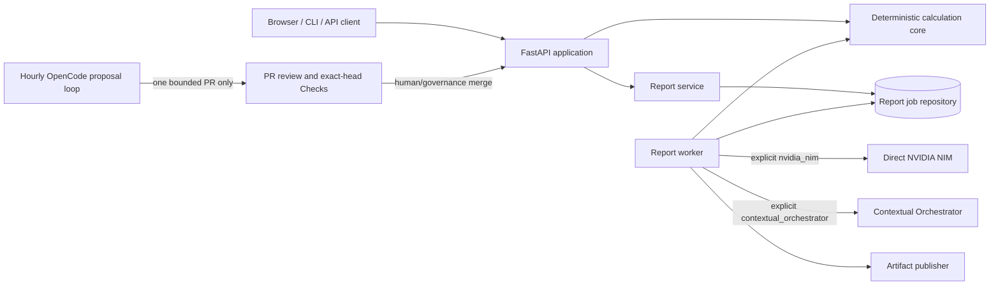

# Four Pillars Architecture

Four Pillars is a deterministic Korean Four Pillars calculation product with an
optional schema-validated interpretation plane. It can run as a complete
standalone service or as a modular MSA component inside ContextualWisdomLab.

## Architectural invariants

1. **Deterministic calculation is authoritative.** Calendar conversion, solar
   terms, pillars, Ten Gods, interactions, luck periods, warnings, and the
   calculation fingerprint are produced without an LLM.
2. **Interpretation is replaceable.** Direct NVIDIA NIM is the standalone
   default. Contextual Orchestrator is an explicit organization adapter.
3. **A model cannot change evidence.** Generated prose is validated against
   Pydantic schemas and deterministic quality gates.
4. **Ports preserve modularity.** Persistence, interpretation, report history,
   idempotency, and artifact publishing are structural interfaces.
5. **Automation proposes; governance decides.** Hourly OpenCode development may
   create one pull request, but it has no merge, release, deployment, or reviewer
   identity.

## Mermaid system view

## Data plane

The API accepts validated birth and report inputs. `calculate_chart` and the luck
calculators create immutable Pydantic evidence. `ReportService` stores a durable
job through a repository port. A worker invokes exactly one selected
interpretation backend, applies strict schemas and quality checks, and publishes
HTML, PDF, JSON, trace, and manifest artifacts through an artifact-publisher
port.

The report-job bounded context owns semantic Python and persistence identifiers:
`report_job_id`, `job_status`, `report_request`, and `job_error_message`. SQLite
stores `report_job_id`, `job_status`, and `job_error_message` directly; startup
migrates the legacy `id`, `status`, and `error` columns inside the existing
`BEGIN IMMEDIATE` schema transaction and recreates the affected indexes with
semantic names. The table remains one 3NF `report_jobs` aggregate, WAL and writer
locking are unchanged, and keyset history keeps the same ordering semantics as
`(created_at DESC, report_job_id DESC)`. The public HTTP representation remains
backward compatible through FastAPI/Pydantic aliases for the historical
`id`/`status`/`error`/`artifacts`/`items` wire keys; those generic keys are
confined to that compatibility adapter rather than the organization-owned domain
or SQLite schema.

No interpretation adapter owns calendar rules, persistence, or file delivery.
An organization can replace any one adapter without forking the deterministic
calculation package.

## Control plane

The minute-17 hourly quality loop is a deterministic sentinel. The minute-47
hourly NVIDIA NIM OpenCode loop is a proposal-only developer. Its three fresh
runners separate model execution, uncredentialed verification, and late-bound
publication. The publisher reconstructs an immutable patch without executing
proposed code, then uses a repository-scoped Maintainer App to open one pull
request.

Existing central `.github` and repository review agents keep their current
identity and credential contracts. The product-development loop never approves,
merges, tags, releases, or deploys.

## Standalone and modular MSA deployment

A standalone installation uses SQLite, the filesystem artifact publisher, and
direct NVIDIA NIM by default. An MSA installation may inject organization
repositories, object storage, a queue, and Contextual Orchestrator while keeping
the same domain models and evidence fingerprint. `naruon` and other CWL products
integrate through explicit HTTP or structural ports rather than importing
private state.

## Trust boundaries

- Birth data and report text are confidential application data.
- Provider credentials stay in environment or secret management and never enter
  prompts, artifacts, traces, or attribution.
- Contextual Orchestrator attribution contains organization labels only.
- GitHub Actions model execution receives `NVIDIA_NIM_API_KEY` but no GitHub
  write token, OIDC token, Actions runtime token, or reviewer credential.
- The verifier receives no model or publication credential.
- The publisher receives no model credential and executes no proposed code.

Detailed operational and standards evidence lives in
`docs/operations/HOURLY_NIM_PRODUCT_DEVELOPMENT.md`,
`docs/doctoring/hourly-nim-opencode-development.md`, and
`docs/standards/TRACEABILITY.md`.
