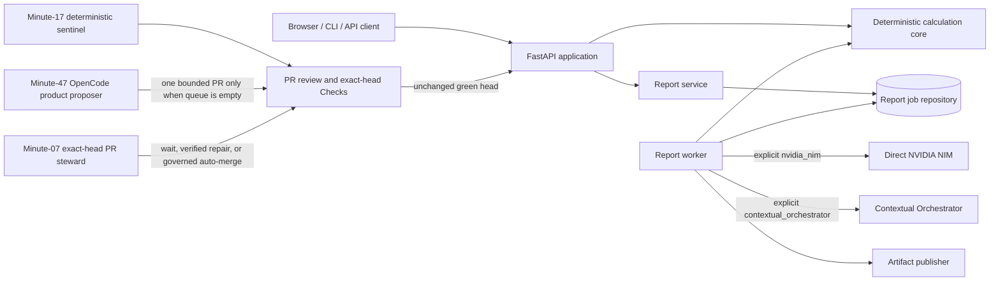
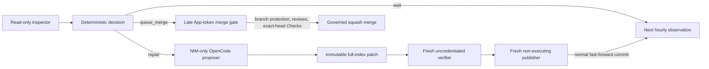

# Four Pillars Architecture

Four Pillars is a deterministic Korean Four Pillars calculation product with an
optional schema-validated interpretation plane. It can run as a complete
standalone service or as a modular MSA component inside ContextualWisdomLab.

## Architectural invariants

1. **Deterministic calculation is authoritative.** Calendar conversion, solar
   terms, pillars, Ten Gods, interactions, luck periods, warnings, and the
   calculation fingerprint are produced without an LLM.
2. **Interpretation is replaceable.** Direct NVIDIA NIM is the standalone
   default. Contextual Orchestrator is an explicit organization adapter.
3. **A model cannot change evidence.** Generated prose is validated against
   Pydantic schemas and deterministic quality gates.
4. **Ports preserve modularity.** Persistence, interpretation, report history,
   idempotency, and artifact publishing are structural interfaces.
5. **Automation proposes; governance decides.** OpenCode can propose bounded
   product or repair patches, but it has no review, approval, merge, release,
   deployment, or reviewer identity.
6. **Exact-head identity crosses every control-plane boundary.** Review evidence,
   patches, verification, publication, and merge bind the PR number, head SHA,
   base SHA, artifact identity, digest, file count, byte count, and Git modes.

## Mermaid system view

## Data plane

The API accepts validated birth and report inputs. `calculate_chart` and the luck
calculators create immutable Pydantic evidence. `ReportService` stores a durable
job through a repository port. A worker invokes exactly one selected
interpretation backend, applies strict schemas and quality checks, and publishes
HTML, PDF, JSON, trace, and manifest artifacts through an artifact-publisher
port.

No interpretation adapter owns calendar rules, persistence, or file delivery.
An organization can replace any one adapter without forking the deterministic
calculation package.

## Control plane

The minute-17 hourly quality loop is a deterministic, model-free sentinel. The
minute-47 NVIDIA NIM/OpenCode loop selects one buyer-visible product Gap only
when open-PR inventory is readable and empty. Its proposal, credential-free
verification, and non-executing publication runners are isolated; the publisher
may open one PR but cannot approve, merge, tag, release, or deploy.

The minute-07 exact-head PR steward advances at most the oldest open non-draft
PR. Its deterministic decision engine consumes a strict versioned JSON snapshot
and returns `wait`, `repair`, or `queue_merge`. Review text and failed-job logs are
bounded untrusted evidence, not executable instructions.

The model runner receives `NVIDIA_NIM_API_KEY` but no GitHub, OIDC, Actions
runtime/cache, command-file, publication, reviewer, or merge credential. The
verifier receives neither model nor publication credentials and executes the
exact patch on Python 3.11 and 3.12 before package, container, security, and SAST
validation. The publisher reconstructs but never executes the patch, mints the
existing repository-scoped Maintainer App token late, rechecks queue position and
head/base identities, then performs one non-force repair push. The merge job
recollects evidence and queues ordinary squash auto-merge with a head-commit
match. It cannot approve, dismiss review, bypass branch protection, force push,
tag, release, or deploy.

Existing central `.github` and repository review agents keep their current
identity, secret names, and provider routing. The steward complements rather
than replaces those reviewers.

## Standalone and modular MSA deployment

A standalone installation uses SQLite, the filesystem artifact publisher, and
direct NVIDIA NIM by default. An MSA installation may inject organization
repositories, object storage, a queue, and Contextual Orchestrator while keeping
the same domain models and evidence fingerprint. `naruon` and other CWL products
integrate through explicit HTTP or structural ports rather than importing
private state.

The PR steward is a repository control-plane module, not an application runtime
dependency. Its workflow supports `workflow_call`, and its standard-library
selection/decision contract can be consumed by central `.github`, `naruon`, or
another repository. Disabling all GitHub automation does not affect the service,
CLI, API, calculation core, worker, database, prompts, or report artifacts.

## Trust boundaries and PII strategy

- Birth data and report text are confidential application data and never enter
  PR-steward evidence.
- Provider credentials stay in environment or secret management and never enter
  prompts, artifacts, traces, or attribution.
- Contextual Orchestrator attribution contains organization labels only.
- Blanket masking is not used for operational source/review evidence because it
  would destroy the diagnostics needed for repair. Instead, collection is
  purpose-limited to one PR, allow-listed, Unicode-normalized, byte-bounded,
  retained for one day, and stripped of customer data, emails, secrets, tokens,
  environment values, report artifacts, and unrelated issues.
- The verifier receives no model or publication credential.
- The publisher receives no model credential and executes no proposed code.
- Exact SHA and artifact digest binding, late short-lived App tokens, normal Git
  history, and immutable GitHub audit logs support future CSAP and SOC 2 control
  evidence; they do not constitute certification or attestation.

Detailed operational and standards evidence lives in
`docs/operations/HOURLY_NIM_PRODUCT_DEVELOPMENT.md`,
`docs/operations/HOURLY_PR_STEWARD.md`,
`docs/doctoring/hourly-nim-opencode-development.md`,
`docs/doctoring/hourly-pr-steward.md`, and
`docs/standards/TRACEABILITY.md`.
