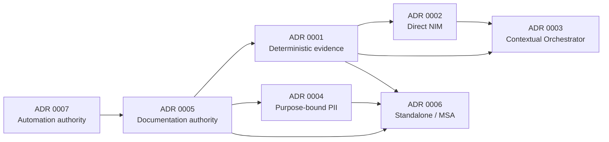

# Four Pillars Architecture Decision Records

Architecture Decision Records (ADRs) capture durable decisions that materially constrain Four Pillars. A chat transcript, implementation plan, pull-request body, or code comment can provide evidence but does not replace an ADR when a decision changes product boundaries, public contracts, trust/authority, persistence, privacy, integration, or release governance.

## Status vocabulary

- **Proposed** — under review or dependent on an unmerged implementation.
- **Accepted** — governs protected-main implementation.
- **Deprecated** — retained for history but should not guide new work.
- **Superseded by ADR NNNN** — replaced by a later accepted decision.
- **Rejected** — evaluated but not adopted.

An ADR becomes Accepted only when the represented behavior or governance contract is integrated into protected `main` or the decision is explicitly accepted as architecture before implementation. Proposed work must never be described as shipped behavior.

## Required ADR structure

Every material ADR should state:

1. status and date;
2. context, drivers and assumptions;
3. decision and ownership boundaries;
4. alternatives considered and why they were rejected;
5. consequences and compatibility impact;
6. failure, degraded-mode and recovery behavior;
7. security, privacy and governance impact;
8. tests, operational acceptance and evidence required;
9. migration and rollback where applicable;
10. reversal/supersession conditions.

## Index

| ADR | Status | Decision |
|---|---|---|
| [0001](0001-deterministic-core-and-nim-boundary.md) | Accepted | Deterministic calculation owns factual chart/luck evidence; AI interpretation cannot rewrite it. |
| [0002](0002-nvidia-nim.md) | Accepted | Direct NVIDIA NIM is the standalone model boundary and uses `NVIDIA_NIM_API_KEY`. |
| [0003](0003-explicit-contextual-orchestrator-backend.md) | Accepted | Contextual Orchestrator is an explicit optional organization adapter with separate credentials and no silent fallback. |
| [0004](0004-purpose-bound-personal-data-controls.md) | Proposed | Preserve product-necessary PII through purpose-bound authorization and cryptographic/audit controls instead of blanket masking. |
| [0005](0005-documentation-as-code-authority.md) | Proposed | Maintain one code-current authoritative PRD/TRD/Architecture/ADR/UML/ERD/documentation graph. |
| [0006](0006-standalone-modular-msa-boundary.md) | Proposed | Standalone and organization deployments share stable ports; services do not reach into each other's application databases. |
| [0007](0007-autonomous-control-plane-authority.md) | Proposed | Separate deterministic quality, model-backed proposal, PR stewardship, review, merge and release authority. |

## Decision dependencies

## Review rule

A material change that contradicts an Accepted ADR must either preserve the accepted invariant or introduce a superseding ADR in the same or prerequisite PR. Editing an old Accepted ADR to erase the historical decision is prohibited except for spelling/link corrections that do not change meaning.
