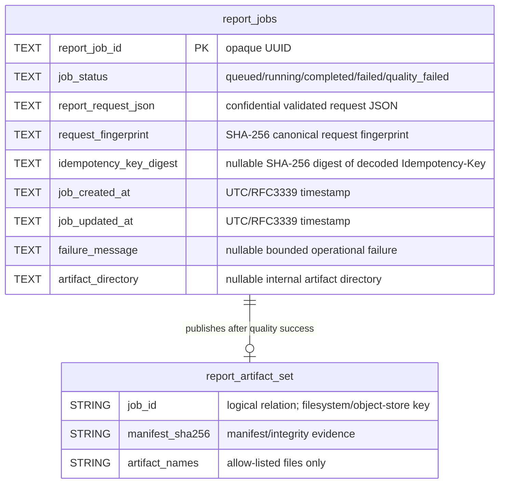
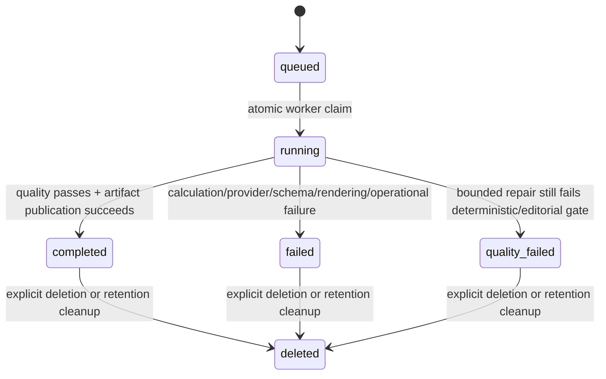

# Four Pillars Logical Data Model and ERD

**Persistence maturity:** standalone SQLite model is `implemented_on_protected_main`; the semantic naming migration in PR #31 is `active_pr`; remote/multi-node persistence is `planned` through the existing repository ports.

This document describes the durable application data that Four Pillars actually owns. It does not invent an enterprise schema merely because the MSA architecture permits a PostgreSQL adapter. The canonical public/redacted status projection is defined separately in `docs/technical/JOB_STATUS_SCHEMA.md`.

## 1. Standalone persistence

The built-in `JobStore` owns one durable application table: `report_jobs`. SQLite WAL provides the single-node queue. The table stores the validated report request because an asynchronous worker must be able to resume processing after the enqueue request has ended.



`report_artifact_set` is a **logical external resource**, not a second SQLite table. Its `job_id` member is already a two-word logical relation name. The standalone `ArtifactPublisher` materializes it under the report-job UUID directory. A remote object-store adapter may implement the same logical relation without creating this SQL object.

## 2. `report_jobs` fields

| Field | Purpose | Sensitivity | Public-history exposure |
|---|---|---|---|
| `report_job_id` | opaque durable report-job identity | operational | adapted to legacy public `id`, authenticated |
| `job_status` | report-job lifecycle state | operational | adapted to legacy public `status`, authenticated |
| `report_request_json` | asynchronous report processing input | confidential personal data | no |
| `request_fingerprint` | idempotency/integrity comparison | internal integrity | no |
| `idempotency_key_digest` | replay protection without storing raw client key | internal security metadata | no |
| `job_created_at` | report-job lifecycle/audit ordering | operational | adapted to legacy public `created_at`, authenticated |
| `job_updated_at` | report-job lifecycle/audit state time | operational | adapted to legacy public `updated_at`, authenticated |
| `failure_message` | bounded operator failure context | potentially sensitive operational data | redacted to legacy public `error`; max 4,000 chars internally |
| `artifact_directory` | internal publication location | internal path | no |

The raw Idempotency-Key is never stored. `report_request_json` and report artifacts are not telemetry fields.

## 3. Naming migration and compatibility boundary

PR #31 replaces the organization-owned generic persistence vocabulary with the report-job bounded-context vocabulary below:

| Legacy SQLite / internal name | Semantic owned name | Compatibility treatment |
|---|---|---|
| `id` | `report_job_id` | legacy Python attribute and public HTTP `id` remain adapter aliases |
| `status` | `job_status` | legacy Python attribute and public HTTP `status` remain adapter aliases |
| `request_json` / `request` | `report_request_json` / `report_request` | stored column and domain field are semantic; structural-port keyword `request` remains version-compatible |
| `created_at` | `job_created_at` | legacy Python attribute and public HTTP `created_at` remain adapter aliases |
| `updated_at` | `job_updated_at` | legacy Python attribute and public HTTP `updated_at` remain adapter aliases |
| `error` | `failure_message` | raw stored diagnostic remains private; public `error` is a redacted compatibility projection |
| `artifact_dir` | `artifact_directory` | legacy Python attribute remains an adapter alias; path is never exposed in public history |

Existing database files are migrated automatically inside `BEGIN IMMEDIATE` with fixed `ALTER TABLE ... RENAME COLUMN` statements. No user-controlled value is interpolated into migration SQL. Existing rows, primary-key values, request payloads, fingerprints, idempotency digests, timestamps, failure text, and artifact paths are preserved. Fresh databases are created directly with semantic column names.

Pydantic `ReportJob` now owns semantic fields and accepts the legacy field spellings as aliases. Read-only legacy Python properties and `model_dump(by_alias=True)` preserve the previous internal/wire-shaped compatibility path while new application code reads semantic fields. FastAPI's established public `ReportJobView` continues to expose `id`, `status`, `created_at`, `updated_at`, `error`, and `artifacts`; `_job_view` is the explicit anti-corruption adapter from the semantic domain model to that versioned HTTP contract.

## 4. Existing indexes and query contract

The standalone database owns these indexes:

```text
idx_report_jobs_job_status_job_created_at
idx_report_jobs_idempotency_key_digest
idx_report_jobs_job_created_at_report_job_id
idx_report_jobs_job_status_job_created_at_report_job_id
```

All application-owned SQLite objects use descriptive two-or-more-word `snake_case`. The SQLite engine may own internal `sqlite_*` objects outside this naming contract. Migration drops the three obsolete generic index names after column migration and recreates their semantic equivalents; the already-specific idempotency index name is retained.

Index purposes:

- `idx_report_jobs_job_status_job_created_at` — queue/status lifecycle lookup;
- `idx_report_jobs_idempotency_key_digest` — unique partial index preventing one non-null idempotency digest from creating multiple jobs;
- `idx_report_jobs_job_created_at_report_job_id` — stable newest-first keyset history traversal;
- `idx_report_jobs_job_status_job_created_at_report_job_id` — the same traversal under exact lifecycle-status filtering.

## 5. Lifecycle state model



A transition to `completed` is valid only after the artifact publisher has successfully made the complete artifact set visible. Partial/staging directories are not completed resources.

## 6. Idempotency, normalization, and write-path analysis

The API accepts one **bounded RFC 8941 structured-string** `Idempotency-Key` under the implementation contract in `src/four_pillars/idempotency.py`:

- the complete HTTP field value must be a quoted structured string;
- only the two RFC 8941 string escapes, `\"` and `\\`, are accepted;
- the decoded value must contain 8 through 128 characters;
- other control/syntax forms are rejected rather than normalized permissively.

The application stores only a SHA-256 digest of the decoded key and calculates a separate canonical request fingerprint.

- same key digest + same request fingerprint → return the existing job;
- same key digest + different request fingerprint → fail with an idempotency-key reuse error;
- no key → retain backward-compatible unique job creation.

The unique partial index is the final standalone race boundary. There is no UPSERT path to rename or weaken: keyed creation performs an explicit lookup inside `BEGIN IMMEDIATE`, then inserts under the unique digest constraint. The naming migration does not change this compare/create behavior, queue-claim ordering, or transaction scope.

The single `report_jobs` relation remains normalized for the embedded queue's owned entities: report-job lifecycle facts depend on `report_job_id`, while `report_request_json` is an intentionally opaque, versioned processing payload rather than an unmodeled relational child entity. The naming migration adds no duplicate/transitive relational dependency and therefore does not degrade the current 3NF boundary. A future relational decomposition of request facts would require a separate data-model decision and migration.

## 7. Concurrency, locking, partitioning, and rollback

SQLite remains a single-node adapter using WAL plus short operation-owned connections. Schema migration starts with `BEGIN IMMEDIATE`; therefore it serializes writers for the bounded startup migration while existing data is renamed in place. It does not introduce a new long-running row-copy/backfill except the pre-existing request-fingerprint backfill for databases that predate that field. Readers and writers resume the existing WAL behavior after commit.

There is no partitioned storage in this adapter, so the rename creates no hot-partition change. Queue selection continues to use `job_status` plus `job_created_at`, and history uses the composite timestamp/identifier indexes. Read/write separation is intentionally absent in this standalone SQLite boundary; a remote multi-node adapter must define it independently rather than inheriting SQLite assumptions.

Rollback of application code should be coordinated with the database naming contract. The migration is data-preserving and mechanically reversible with the inverse fixed column/index renames, but operators should quiesce writes before an application rollback so old code never observes the semantic schema without its compatibility-aware version. No automatic downgrade migration is executed at runtime.

## 8. History/cursor model

Public history serializes exactly `JOB_STATUS_SCHEMA.md`: it does not expose `report_request_json`, request/calculation fingerprints, idempotency material, generated report text, model traces, credentials, or internal artifact paths. The SQLite keyset order is:

```sql
ORDER BY job_created_at DESC, report_job_id DESC
```

The public continuation contract is unchanged: a cursor encodes only a strict version, UTC timestamp, and random job UUID. New inserts may appear on a later first-page read but do not mutate the ordering boundary of an existing continuation sequence.

## 9. Artifact data model

A successful job can publish the following logical artifact set:

```text
chart.json
luck JSON outputs
report.json
traces.json
manifest.json
report.html
report.pdf
```

The manifest binds files to hashes, calculation fingerprint, model/prompt identity, and generation evidence. Artifact filenames are server allow-listed. Subject names or birth data are not used in filesystem/object-store keys.

## 10. Standalone-to-MSA mapping

| Logical capability | Standalone adapter | MSA replacement requirement |
|---|---|---|
| ReportJobRepository | SQLite `report_jobs` | durable transactional repository/queue with equivalent lifecycle semantics |
| Idempotent creation | `BEGIN IMMEDIATE` + unique digest index | atomic compare/create with durable uniqueness and same public key syntax |
| History traversal | SQLite composite indexes + opaque cursor | globally stable `(job_created_at, report_job_id)` exclusive keyset semantics internally while preserving the versioned public cursor |
| ArtifactPublisher | UUID filesystem directory | object storage or governed artifact service with atomic visibility/integrity |
| ReportInterpreter | direct NIM by default | injected organization adapter such as Contextual Orchestrator |

A remote adapter must not expose another service's private database as the integration contract. Cross-service integration is through the Four Pillars ports/APIs and immutable artifacts. Existing structural-port keyword spellings are compatibility surfaces; a future semantic keyword rename must be separately versioned or adapted rather than silently breaking keyword callers.

## 11. Data retention and deletion

Default report retention is 30 days unless deployment policy sets another bounded value. Explicit deletion is coordinated so a rejected durable-row deletion cannot destroy the only published artifact copy:

1. fetch the current report job and derive only an exact trusted UUID artifact directory/object prefix;
2. ask the authoritative repository to delete the terminal report-job row/state;
3. if the repository refuses the delete (for example because the job is not terminal), return a conflict and leave artifacts untouched;
4. only after durable deletion succeeds, remove the trusted artifact tree;
5. if artifact cleanup fails after row deletion, return a bounded failure and permit a retry to clean the exact trusted orphan by report-job ID without reconstructing a personal path.

Enterprise adapters must define equivalent compensation/retry semantics for database/object-store partial failure and must never report deletion success when authoritative cleanup is incomplete.

Additional deployment requirements:

- retention policy and legal/contractual overrides;
- backup expiration/deletion limitations;
- auditable privileged restoration;
- failure signaling and retry for incomplete cleanup;
- no deletion of an artifact path outside the configured authority boundary.

## 12. Planned multi-node evolution

`planned` multi-node deployment may use PostgreSQL and object storage, but schema design must be reviewed when implemented. It must preserve:

- opaque non-semantic identifier values carried by semantically specific identifier names;
- purpose-bound sensitive request storage;
- two-or-more-word `snake_case` database object names;
- atomic queue/idempotency semantics;
- stable history order and canonical public status schema;
- explicit tenant/authorization ownership if tenancy is introduced;
- rollback-compatible migrations and versioned contracts;
- explicit compensation for cross-resource deletion/publication failures.

This document intentionally does not create hypothetical production tables for future features.
