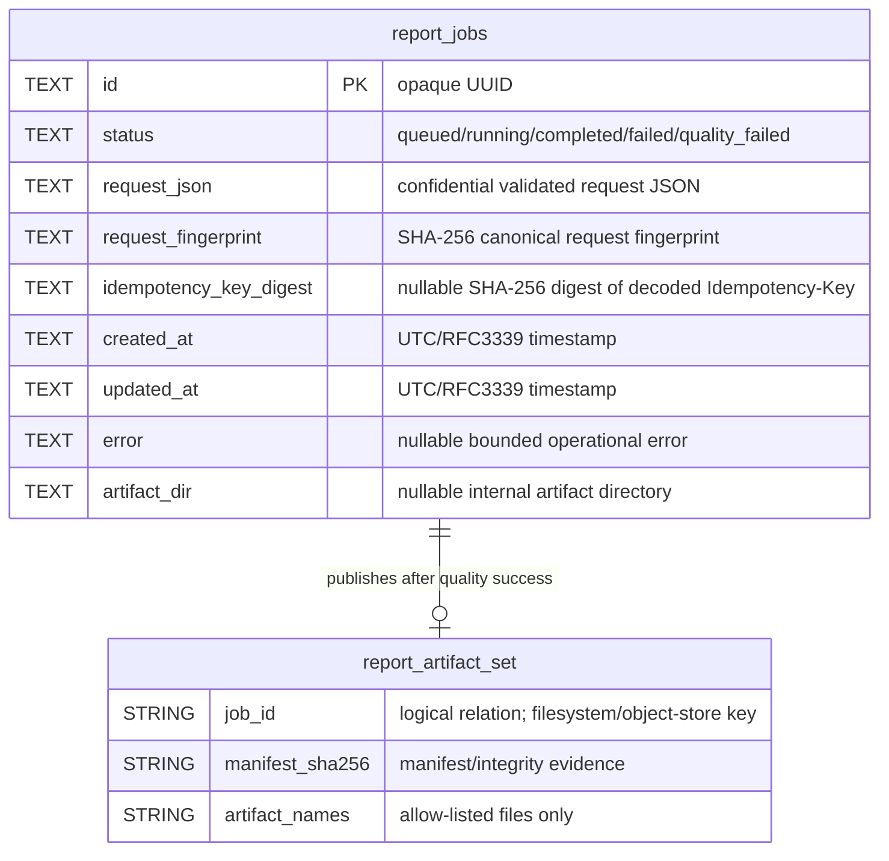
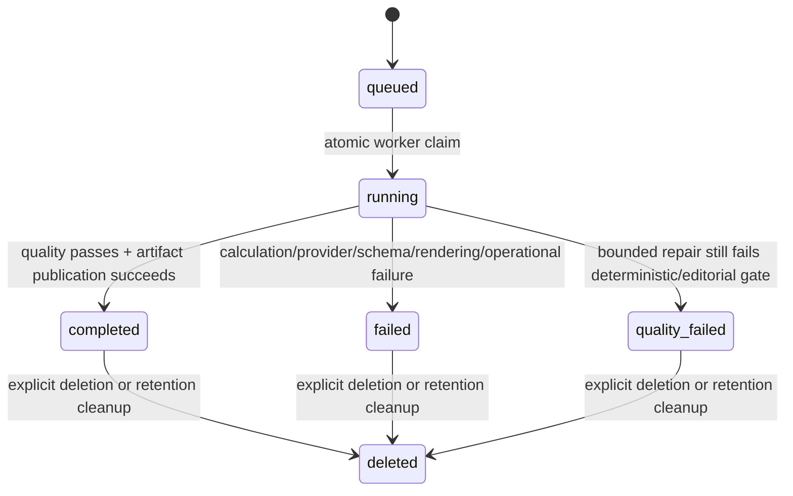

# Four Pillars Logical Data Model and ERD

**Persistence maturity:** standalone SQLite model is `implemented_on_protected_main`; remote/multi-node persistence is `planned` through the existing repository ports.

This document describes the durable application data that Four Pillars actually owns. It does not invent an enterprise schema merely because the MSA architecture permits a PostgreSQL adapter. The canonical public/redacted status projection is defined separately in `docs/technical/JOB_STATUS_SCHEMA.md`.

## 1. Standalone persistence

The built-in `JobStore` owns one durable application table: `report_jobs`. SQLite WAL provides the single-node queue. The table stores the validated report request because an asynchronous worker must be able to resume processing after the enqueue request has ended.



`report_artifact_set` is a **logical external resource**, not a second SQLite table. The standalone `ArtifactPublisher` materializes it under the job UUID directory. A remote object-store adapter may implement the same logical relation without creating this SQL object.

## 2. `report_jobs` fields

| Field | Purpose | Sensitivity | Public-history exposure |
|---|---|---|---|
| `id` | opaque durable job identity | operational | yes, authenticated |
| `status` | lifecycle state | operational | yes, authenticated |
| `request_json` | asynchronous processing input | confidential personal data | no |
| `request_fingerprint` | idempotency/integrity comparison | internal integrity | no |
| `idempotency_key_digest` | replay protection without storing raw client key | internal security metadata | no |
| `created_at` | lifecycle/audit ordering | operational | yes, authenticated |
| `updated_at` | lifecycle/audit state time | operational | yes, authenticated |
| `error` | bounded operator/user failure context | potentially sensitive operational data | only via `JOB_STATUS_SCHEMA.md`, max 4,000 chars |
| `artifact_dir` | internal publication location | internal path | no |

The raw Idempotency-Key is never stored. `request_json` and report artifacts are not telemetry fields.

## 3. Existing indexes and naming contract

The standalone database owns these indexes:

```text
idx_report_jobs_status_created
idx_report_jobs_idempotency_key_digest
idx_report_jobs_created_id
idx_report_jobs_status_created_id
```

All application-owned objects use descriptive multiword `snake_case`. The SQLite engine may own internal `sqlite_*` objects outside this naming contract.

Index purposes:

- `idx_report_jobs_status_created` — queue/status lifecycle lookup;
- `idx_report_jobs_idempotency_key_digest` — unique partial index preventing one non-null idempotency digest from creating multiple jobs;
- `idx_report_jobs_created_id` — stable newest-first keyset history traversal;
- `idx_report_jobs_status_created_id` — the same traversal under exact lifecycle-status filtering.

## 4. Lifecycle state model



A transition to `completed` is valid only after the artifact publisher has successfully made the complete artifact set visible. Partial/staging directories are not completed resources.

## 5. Idempotency model

The API accepts one **bounded RFC 8941 structured-string** `Idempotency-Key` under the implementation contract in `src/four_pillars/idempotency.py`:

- the complete HTTP field value must be a quoted structured string;
- only the two RFC 8941 string escapes, `\"` and `\\`, are accepted;
- the decoded value must contain 8 through 128 characters;
- other control/syntax forms are rejected rather than normalized permissively.

The application stores only a SHA-256 digest of the decoded key and calculates a separate canonical request fingerprint.

- same key digest + same request fingerprint → return the existing job;
- same key digest + different request fingerprint → fail with an idempotency-key reuse error;
- no key → retain backward-compatible unique job creation.

The unique partial index is the final standalone race boundary. A multi-node adapter must provide an equivalent atomic uniqueness guarantee at its own consistency boundary and must accept the same API key syntax unless a versioned public API revision changes it.

## 6. History/cursor model

Public history serializes exactly `JOB_STATUS_SCHEMA.md`: it does not expose `request_json`, request/calculation fingerprints, idempotency material, generated report text, model traces, credentials, or internal artifact paths. Keyset order is:

```sql
ORDER BY created_at DESC, id DESC
```

A continuation cursor encodes only a strict version, UTC timestamp, and random job UUID. New inserts may appear on a later first-page read but do not mutate the ordering boundary of an existing continuation sequence.

## 7. Artifact data model

A successful job can publish the following logical artifact set:

```text
chart.json
luck JSON outputs
report.json
traces.json
manifest.json
report.html
report.pdf
```

The manifest binds files to hashes, calculation fingerprint, model/prompt identity, and generation evidence. Artifact filenames are server allow-listed. Subject names or birth data are not used in filesystem/object-store keys.

## 8. Standalone-to-MSA mapping

| Logical capability | Standalone adapter | MSA replacement requirement |
|---|---|---|
| ReportJobRepository | SQLite `report_jobs` | durable transactional repository/queue with equivalent lifecycle semantics |
| Idempotent creation | `BEGIN IMMEDIATE` + unique digest index | atomic compare/create with durable uniqueness and same public key syntax |
| History traversal | SQLite composite indexes + opaque cursor | globally stable `(created_at, id)` exclusive keyset semantics across API replicas |
| ArtifactPublisher | UUID filesystem directory | object storage or governed artifact service with atomic visibility/integrity |
| ReportInterpreter | direct NIM by default | injected organization adapter such as Contextual Orchestrator |

A remote adapter must not expose another service's private database as the integration contract. Cross-service integration is through the Four Pillars ports/APIs and immutable artifacts.

## 9. Data retention and deletion

Default report retention is 30 days unless deployment policy sets another bounded value. Explicit deletion is coordinated so a rejected durable-row deletion cannot destroy the only published artifact copy:

1. fetch the current job and derive only an exact trusted UUID artifact directory/object prefix;
2. ask the authoritative repository to delete the terminal job row/state;
3. if the repository refuses the delete (for example because the job is not terminal), return a conflict and leave artifacts untouched;
4. only after durable deletion succeeds, remove the trusted artifact tree;
5. if artifact cleanup fails after row deletion, return a bounded failure and permit a retry to clean the exact trusted orphan by job ID without reconstructing a personal path.

Enterprise adapters must define equivalent compensation/retry semantics for database/object-store partial failure and must never report deletion success when authoritative cleanup is incomplete.

Additional deployment requirements:

- retention policy and legal/contractual overrides;
- backup expiration/deletion limitations;
- auditable privileged restoration;
- failure signaling and retry for incomplete cleanup;
- no deletion of an artifact path outside the configured authority boundary.

## 10. Planned multi-node evolution

`planned` multi-node deployment may use PostgreSQL and object storage, but schema design must be reviewed when implemented. It must preserve:

- opaque non-semantic identifiers;
- purpose-bound sensitive request storage;
- two-or-more-word `snake_case` database object names;
- atomic queue/idempotency semantics;
- stable history order and canonical public status schema;
- explicit tenant/authorization ownership if tenancy is introduced;
- rollback-compatible migrations and versioned contracts;
- explicit compensation for cross-resource deletion/publication failures.

This document intentionally does not create hypothetical production tables for future features.
