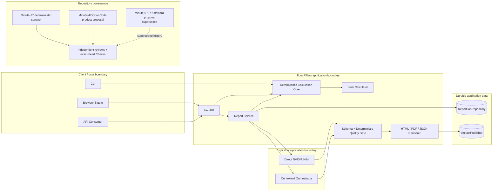
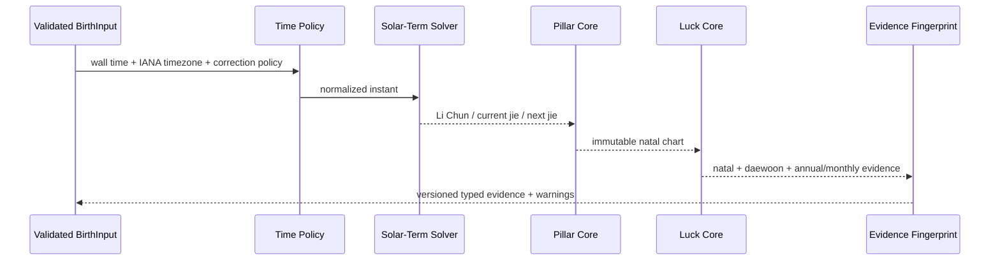
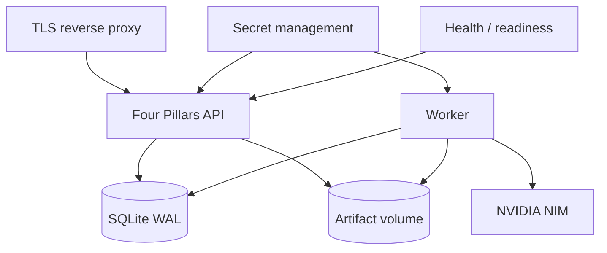
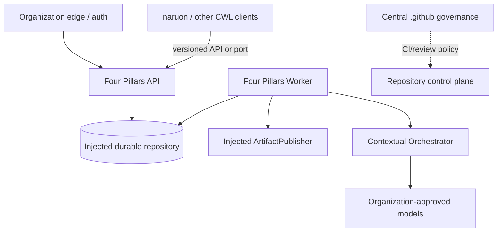

# Four Pillars System Architecture

**Baseline maturity:** `implemented_on_protected_main` unless a section says otherwise.  
**Protected-main reference for this document:** `cd4f4e6361238a1db43c28540640a407c7bf7c6e`.

This document complements root `ARCHITECTURE.md` and `docs/uml/architecture.md`. It organizes the architecture by stakeholder concern and trust boundary so a platform buyer, operator, reviewer, or integrator can understand the product without reconstructing GitHub or conversation history.

## 1. System of interest and stakeholders

The system of interest is the Four Pillars application and reusable package: deterministic calendar/luck calculation, structured report interpretation, quality control, durable report-job lifecycle, browser/API/CLI delivery, and replaceable deployment adapters.

| Stakeholder | Primary concerns |
|---|---|
| Reader | transparent inputs, understandable report, uncertainty, privacy, deletion |
| Consultant | reproducibility, consistent report structure, recent-job recovery, export |
| Platform integrator | stable API/models, deterministic core, ports/adapters, no hidden coupling |
| Operator | availability, recovery, secrets, retention, backup, incidents, cost/provider behavior |
| Security/privacy reviewer | personal-data purpose, trust zones, provider disclosure, least privilege |
| AI governance reviewer | immutable evidence, explicit backend, model traceability, fail-closed quality |
| Maintainer/reviewer | exact-head tests, architecture decisions, release evidence, non-overlapping writers |
| Acquirer | quality evidence, operational ownership, portability, security/privacy, provenance |

## 2. Architecture maturity

- Deterministic calculation, direct NIM, optional Contextual Orchestrator, queue/history/idempotency, report rendering, browser recovery, minute-17 sentinel, and minute-47 product-development loop are `implemented_on_protected_main`.
- Purpose-bound personal-data processing and canonical documentation authority are `accepted_architecture` and become protected-main documentation when this PR merges.
- PR #29's minute-07 PR steward is `superseded` historical evidence because that PR closed without merge; it is neither active nor shipped.
- Multi-node PostgreSQL/managed-queue adapters, distributed tracing, enterprise identity/billing, and certification are `planned` unless a separate protected-main implementation says otherwise.
- Superseded plans/PRs remain `superseded` evidence, not current architecture.

## 3. Product and trust-boundary view

### Authority rules

- `Calc` and `Fortune` own calculated evidence. Interpretation cannot modify it.
- The deployment explicitly chooses Direct NIM or Contextual Orchestrator. No silent fallback changes data recipients.
- `ReportJobRepository`, optional idempotency/history capabilities, `ReportInterpreter`, and `ArtifactPublisher` are replaceable application ports.
- GitHub automation may propose/verify changes only inside its documented authority; independent review/branch governance remains a separate decision layer.

## 4. Deterministic calculation viewpoint

The deterministic plane performs solar/lunar input conversion, timezone/optional solar-time normalization, precise `jie` boundary solving, year/month/day/hour pillar construction, Ten Gods, hidden stems, Twelve Growth stages, element balance, interactions, and luck calculations. It records an evidence/calculation version and SHA-256 fingerprint.

Current solar-term calculation uses a bounded VSOP87-based implementation and independent KASI/NAOJ 2026 minute-precision fixtures. Boundary-specific tests are more authoritative than an LLM explanation. The product must display or retain boundary uncertainty rather than silently choose another result.

## 5. Interpretation and AI viewpoint

The application supplies deterministic evidence and untrusted user context to exactly one selected structured-generation adapter. Output must validate against Pydantic schemas and quality rules. Editorial repair is bounded and may change prose only.

- Direct backend credential: `NVIDIA_NIM_API_KEY`.
- Organization gateway credential: `CONTEXTUAL_ORCHESTRATOR_TOKEN`.
- Organizational attribution is prompt-safe and excludes personal subject context.
- No provider/model judgment can override deterministic evidence or merge/release governance.
- LLM-as-a-judge remains supplementary rather than an oracle.

For future orchestration changes, comparable-budget single-model versus staged/multi-agent modes should be evaluated with role-specific reasoning effort, bounded recursion, explicit access lists, and ablation evidence; speed is not the principal optimization target.

## 6. Persistence and artifact viewpoint

The standalone edition uses one SQLite `report_jobs` table plus an artifact directory rooted by opaque job UUID. The logical model and exact indexes are documented in `DATA_MODEL.md`.

The MSA architecture must preserve the same observable contracts when replacing SQLite/filesystem with PostgreSQL, a managed queue, or object storage. Services must not read another CWL product's private application database directly.

## 7. Privacy/security viewpoint

Personal birth/context data is not blanket-masked when the requested calculation or interpretation requires it. Instead the product applies purpose limitation, minimum necessary disclosure, authenticated access, TLS, retention/deletion, restricted telemetry, secret separation, and auditable privileged access. See ADR 0004 and `docs/security/THREAT_MODEL.md`.

The architecture distinguishes:

- confidential subject data;
- operational metadata safe for authenticated history/status;
- integrity/provenance data;
- credentials/secrets;
- generated report artifacts.

## 8. Standalone deployment viewpoint

The standalone edition is intentionally single-node for durable queue/filesystem semantics. A model outage must not prevent calculation-only endpoints from functioning.

## 9. Organization MSA viewpoint

Four Pillars remains deployable without central `.github`, `naruon`, or Contextual Orchestrator. Integration uses explicit APIs/ports/artifacts, not hidden imports or cross-service database reads.

## 10. Automation/governance viewpoint

### `implemented_on_protected_main`

- minute-17 deterministic quality sentinel;
- minute-47 NVIDIA NIM/OpenCode product-development proposal loop;
- exact-head CI/security/release governance already present in repository workflows.

### `superseded`

- PR #29 is `superseded` history: its minute-07 exact-head PR steward proposal closed without merge and has no current execution authority.

The canonical operations contract is `docs/operations/AUTONOMOUS_DEVELOPMENT.md`. One bounded PR per product-development run is a writer-safety constraint, not permission to stop after a single RCA, test, documentation edit, or reviewer wait.

## 11. Quality and release viewpoint

Release evidence must bind to the exact integrated protected-main commit. The release path requires deterministic tests, exact 100% owned production statement and branch coverage, public docstrings, package/container build, security/SAST gates, relevant independent review, provenance/checksums, and operational acceptance appropriate to the changed feature.

The architecture does not equate a successful generated report, a model review, or a single green check with release readiness.

## 12. Documentation view map

- Product intent and acceptance: `docs/product/PRD.md`
- Technical component requirements: `docs/technical/TRD.md`
- System viewpoints: this document
- Detailed UML: `docs/uml/architecture.md`
- Durable data/ERD: `docs/architecture/DATA_MODEL.md`
- Architecture decisions: `docs/adr/README.md`
- Threat/control model: `docs/security/THREAT_MODEL.md`
- Test/release evidence: `docs/technical/TEST_STRATEGY.md`
- SLI/SLO/recovery: `docs/operations/OPERABILITY.md`
- Standards/research mapping: `docs/standards/TRACEABILITY.md`
- Documentation fitness: `docs/standards/DOCUMENTATION_AUDIT.md`

## References — APA 7th

International Organization for Standardization. (2022). *ISO/IEC/IEEE 42010:2022 Software, systems and enterprise—Architecture description* (2nd ed.). ISO.

International Organization for Standardization. (2023). *ISO/IEC 25010:2023 Systems and software engineering—Systems and software Quality Requirements and Evaluation (SQuaRE)—Product quality model* (2nd ed.). ISO.
