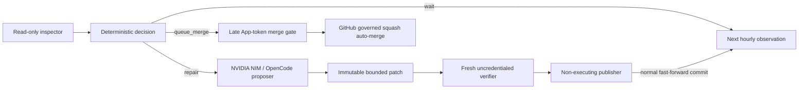

# Hourly exact-head pull-request steward — evidence doctoring

## Claim boundary

The minute-07 steward is a repository-maintenance control plane for both
**standalone** Four Pillars operation and **modular** MSA reuse by central
`.github`, `naruon`, and other ContextualWisdomLab repositories. It does not prove
semantic correctness, replace independent review, establish that an LLM repair
is safe, or grant a model authority to approve, merge, release, or deploy.

A digest proves artifact identity, not meaning. A green test suite proves only
its encoded contract. Automated reviewers and LLMs can miss defects or create
false positives. Branch protection, exact-head Checks, current review state,
current unresolved threads, deterministic tests, Security Scan, SAST, and human
escalation remain authoritative.

The controls below support future CSAP and SOC 2 evidence collection. This file
is **not a certification**, attestation, audit report, legal opinion, or claim of
conformity with CSAP, SOC 2, ISO/IEC 42001, ISO/IEC 23894, or NIST publications.

## Trust-zone design

The model runner receives only `NVIDIA_NIM_API_KEY`. It receives no GitHub,
OIDC, Actions runtime/cache, command-file, reviewer, publication, or merge
credential. `COPILOT_GITHUB_TOKEN` is prohibited. The verifier receives neither
model nor publication credentials. The publisher executes no proposed code and
mints the existing repository-scoped Maintainer App token only after exact
artifact and branch revalidation.

## Source-to-control trace

| Decision | Evidence basis | Repository control |
|---|---|---|
| Keep changes inside ordinary PR governance | GitHub protected-branch and auto-merge documentation | The steward uses exact-head squash auto-merge and never uses `--admin`, approval, review dismissal, force push, tag, release, or deployment. |
| Use short-lived least privilege | GitHub App authentication and Actions hardening | App credentials are minted only in publisher and merge jobs after immutable evidence validation. |
| Treat automation inputs as untrusted | GitHub Actions hardening; NIST SP 800-218; NIST SP 800-218A | Review text and failed logs are strict-schema, byte-bounded untrusted evidence; proposed code runs only on a fresh verifier. |
| Separate preparation, verification, and authority | NIST SP 800-218/218A; ISO/IEC 42001:2023; ISO/IEC 23894:2023 | Inspection, NIM proposal, credential-free verification, non-executing publication, and merge are separate jobs. |
| Preserve useful diagnostics without blanket masking | CSAP evidence framing; AICPA Trust Services Criteria | Collection excludes customer data and secrets while retaining bounded Korean source/review diagnostics. |
| Minimize retention | GitHub artifact controls and data-minimization principles | Evidence and repair artifacts use **one-day retention**. |
| Bind every handoff | Secure change-management and integrity principles | PR number, head/base SHA, numeric artifact ID, server digest, patch SHA-256, file/byte counts, and Git modes are revalidated. |
| Allocate model compute by task | Fugu; Conductor; TRINITY | One bounded repair starts with one routed worker; deterministic selection, verification, publication, and merge are separate roles. |
| Preserve release evidence | ISO/IEC 25010:2023 and repository policy | Python 3.11/3.12, 100% statement and branch coverage, docstrings, package, container, security, and SAST gates remain mandatory. |

## Current standards status reviewed on 2026-08-07

NIST SP 800-218 Version 1.1 remains final. NIST published SP 800-218 Rev. 1 as
the initial public draft of SSDF Version 1.2 on December 17, 2025; its public
comment period is closed, so the draft is informative rather than a final
compliance baseline. NIST SP 800-218A is final and augments SSDF for AI-model
development. Four Pillars therefore uses final SP 800-218 and SP 800-218A as
engineering guidance and tracks the Version 1.2 draft for later reviewed
adoption.

KISA describes CSAP as a statutory certification process with application,
assessment, remediation, committee, certificate, and recurring surveillance
steps. Repository controls can prepare evidence; only the designated process can
issue CSAP certification.

AICPA describes SOC 2 as an examination of a service organization's system and
controls relevant to security, availability, processing integrity,
confidentiality, or privacy. The Trust Services Criteria support attestation or
consulting work; internal automation cannot self-issue a SOC 2 report.

## PII and confidentiality alternative to blanket masking

Blanket PII masking is not used for source, Korean diagnostics, review text, or
stack traces because it would make repairs unreliable. The replacement is:

1. **Purpose limitation:** only exact PR identity, reviews, threads, Check states,
   and bounded failed-job diagnostics.
2. **Data exclusion:** no birth input, user context, generated report, model
   trace, artifact path, customer record, email address, API key, token,
   environment dump, or unrelated issue.
3. **Least privilege:** read-only inspector, `NVIDIA_NIM_API_KEY`-only proposer,
   uncredentialed verifier, and late repository-scoped App token.
4. **Content controls:** strict schemas, allow-listed URLs and identifiers,
   Unicode normalization, control/bidirectional removal, item/byte caps,
   credential-looking log-line redaction, and symlink/gitlink rejection.
5. **Retention:** one-day retention for evidence and repair artifacts.
6. **Integrity and audit:** exact SHA/digest binding, normal commits, review
   history, Check history, GitHub Actions logs, and deterministic reason codes.
7. **Change management:** no force push, self-approval, review dismissal,
   administrative merge, tag, release, or deployment.

## Orchestration research application

**Fugu** motivates routing between direct model work and deeper coordinated
execution. A single exact-head repair defaults to a single routed worker.

**Conductor** motivates explicit decomposition, access lists, and controlled
delegation. The steward fixes the stages and denies task delegation inside
OpenCode.

**TRINITY** motivates specialized thinker, worker, verifier, and synthesis roles.
The model is only a worker/proposer; deterministic selection, verification,
publication, and GitHub governance are independent roles. Private
chain-of-thought is not operational evidence.

These papers support design hypotheses, not a claim that multi-agent conduct
improves every repair. A future ablation must compare routed and bounded-conduct
execution on identical PR fixtures, deterministic tests, provider-reported
usage, review outcomes, failure rates, and security findings. Speed is not the
primary objective, but reproducibility and bounded cost remain mandatory.

## Residual risks

- An ephemeral verifier has ordinary egress unless runner networking is further
  constrained.
- Malicious tests can consume resources or probe the runner; fresh runners,
  timeouts, and secret removal reduce but do not eliminate this risk.
- Prompt injection can exist in reviews and logs; schema validation and explicit
  untrusted-data labels do not prove model obedience.
- A compromised Maintainer App remains a mutation risk; short-lived late tokens
  do not replace key rotation, installation review, and audit.
- GitHub API, runner, or reviewer outages delay progress. Unknown state fails
  closed and is observed on the next hourly run.
- Green Checks can coexist with untested behavior; realistic domain fixtures and
  independent review remain necessary.
- Locally available `semgrep scan --config auto` may resolve remote rules;
  repository-required exact-head SAST remains authoritative.

## Research-service limitation

Consensus was queried on 2026-08-07 for recent autonomous secure-software-agent
research, but the connected account reported its monthly quota exhausted. No
paper result from that query is represented as evidence. Primary official
sources and the repository's existing Fugu, Conductor, and TRINITY sources were
used instead.

## APA 7th references

American Institute of Certified Public Accountants. (2023). *2017 trust services
criteria for security, availability, processing integrity, confidentiality, and
privacy (with revised points of focus—2022)*. AICPA & CIMA.
https://www.aicpa-cima.com/resources/download/2017-trust-services-criteria-with-revised-points-of-focus-2022

Booth, H., Ogata, M., Kent, K., Souppaya, M., & Dodson, D. (2025). *Secure
software development framework (SSDF) version 1.2: Recommendations for mitigating
the risk of software vulnerabilities* (NIST SP 800-218 Rev. 1, Initial Public
Draft). National Institute of Standards and Technology.
https://csrc.nist.gov/pubs/sp/800/218/r1/ipd

Booth, H., Souppaya, M., Vassilev, A., Ogata, M., Stanley, M., & Scarfone, K.
(2024). *Secure software development practices for generative AI and dual-use
foundation models: An SSDF community profile* (NIST SP 800-218A). National
Institute of Standards and Technology. https://doi.org/10.6028/NIST.SP.800-218A

GitHub. (n.d.-a). *About protected branches*. GitHub Docs. Retrieved August 7,
2026, from https://docs.github.com/en/repositories/configuring-branches-and-merges-in-your-repository/managing-protected-branches/about-protected-branches

GitHub. (n.d.-b). *Automatically merging a pull request*. GitHub Docs. Retrieved
August 7, 2026, from https://docs.github.com/en/pull-requests/collaborating-with-pull-requests/incorporating-changes-from-a-pull-request/automatically-merging-a-pull-request

GitHub. (n.d.-c). *Making authenticated API requests with a GitHub App in a
GitHub Actions workflow*. GitHub Docs. Retrieved August 7, 2026, from
https://docs.github.com/en/apps/creating-github-apps/writing-code-for-a-github-app/making-authenticated-api-requests-with-a-github-app-in-a-github-actions-workflow

GitHub. (n.d.-d). *Security hardening for GitHub Actions*. GitHub Docs.
Retrieved August 7, 2026, from
https://docs.github.com/en/actions/security-for-github-actions/security-guides/security-hardening-for-github-actions

International Organization for Standardization. (2023a). *ISO/IEC 23894:2023
Information technology—Artificial intelligence—Guidance on risk management*.
https://www.iso.org/standard/77304.html

International Organization for Standardization. (2023b). *ISO/IEC 42001:2023
Information technology—Artificial intelligence—Management system*.
https://www.iso.org/standard/42001.html

International Organization for Standardization. (2023c). *ISO/IEC 25010:2023
Systems and software engineering—Systems and software quality requirements and
evaluation (SQuaRE)—Product quality model*.
https://www.iso.org/standard/78176.html

Korea Internet & Security Agency. (2025). *2025년 클라우드서비스 보안인증제도
안내서*. https://isms.kisa.or.kr/main/csap/notice

Korea Internet & Security Agency. (n.d.). *클라우드 보안인증제 제도소개*.
Retrieved August 7, 2026, from https://isms.kisa.or.kr/main/csap/intro/index.jsp

National Institute of Standards and Technology. (2022). *Secure software
development framework (SSDF) version 1.1: Recommendations for mitigating the risk
of software vulnerabilities* (NIST SP 800-218).
https://doi.org/10.6028/NIST.SP.800-218

Nielsen, S., Cetin, E., Schwendeman, P., Sun, Q., Xu, J., & Tang, Y. (2025).
*Learning to orchestrate agents in natural language with the Conductor*
[Preprint]. arXiv. https://arxiv.org/abs/2512.04388

NVIDIA. (n.d.). *NVIDIA NIM for large language models documentation*. Retrieved
August 7, 2026, from https://docs.nvidia.com/nim/large-language-models/latest/

OpenCode. (n.d.). *OpenCode documentation*. Retrieved August 7, 2026, from
https://opencode.ai/docs/

Sakana AI. (2026, June 22). *Sakana Fugu: One model to command them all*.
https://sakana.ai/fugu-release/

Xu, J., Sun, Q., Schwendeman, P., Nielsen, S., Cetin, E., & Tang, Y. (2025).
*TRINITY: An evolved LLM coordinator* [Preprint]. arXiv.
https://arxiv.org/abs/2512.04695
