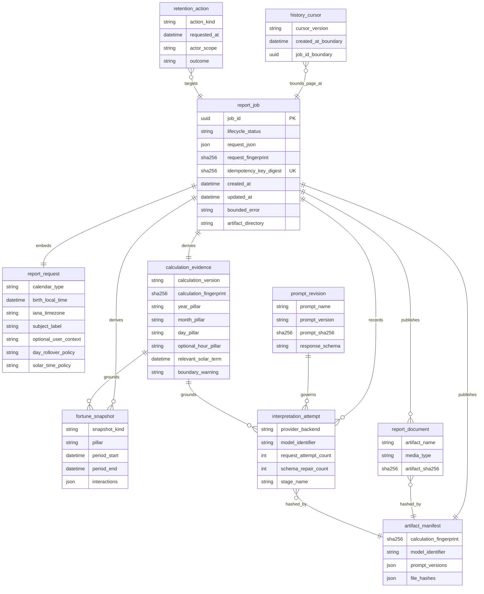
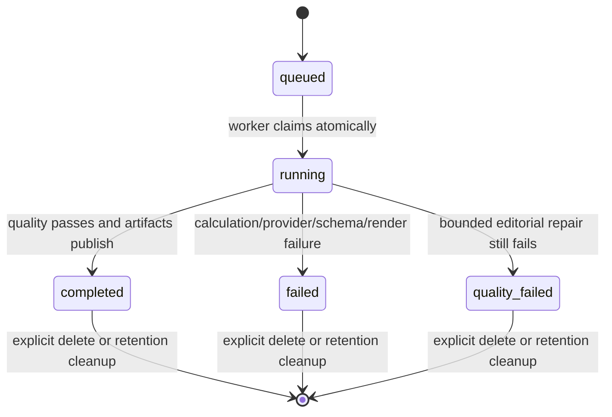
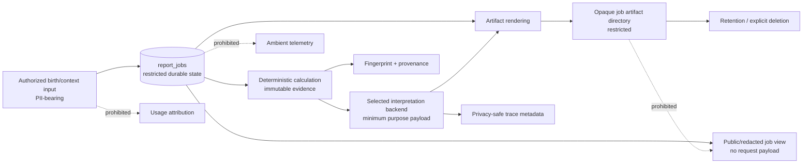

# Four Pillars Data Model and ERD

- Status: Current conceptual/logical model with explicit persistence classification
- Baseline: protected `main` at `cd4f4e6361238a1db43c28540640a407c7bf7c6e`
- Reviewed: 2026-08-09

## Purpose

This document makes data ownership and persistence explicit. It is an architectural model, not a claim that every box is a database table. Four Pillars currently uses one application-owned SQLite table, `report_jobs`, plus filesystem artifacts. Several other entities are typed/domain concepts or generated files. GitHub automation evidence is external control-plane state, not application persistence.

Application-owned database object names must contain at least two descriptive words and use `snake_case` by default. The current table and indexes conform to that convention.

## Persistence classification

| Entity | Classification | Current storage / authority |
|---|---|---|
| `report_job` | Persisted | SQLite table `report_jobs` through `JobStore` |
| `report_request` | Embedded persisted payload | JSON field `report_jobs.request_json`; not a separate table |
| `calculation_evidence` | Derived / serialized artifact | Deterministic typed models and JSON; source of truth is calculation code + policy version + input |
| `fortune_snapshot` | Derived / serialized artifact | Daewoon/annual/monthly JSON generated for a job |
| `prompt_revision` | Package/config provenance | Versioned prompt files and hashes; not a DB table |
| `interpretation_attempt` | Runtime / privacy-safe trace artifact | `traces.json` contains bounded metadata; no credential storage |
| `report_document` | Generated artifact | `report.json`, `report.html`, `report.pdf` under opaque job directory |
| `artifact_manifest` | Generated artifact | `manifest.json` with hashes/provenance |
| `history_cursor` | Derived transport token | Opaque cursor derived from `created_at` + random job UUID; not persisted |
| `retention_action` | Operational event | Deletion/cleanup behavior; currently no separate audit table |
| `automation_proposal` | External control-plane concept | GitHub Actions artifact/branch/PR state, not application DB |
| `review_evidence` | External control-plane concept | GitHub review/check API evidence, not application DB |
| `release_evidence` | External control-plane concept | GitHub release/workflow/artifact state, not application DB |

## Current physical SQLite schema

`src/four_pillars/jobs.py` owns the schema:

```sql
CREATE TABLE IF NOT EXISTS report_jobs (
    id TEXT PRIMARY KEY,
    status TEXT NOT NULL,
    request_json TEXT NOT NULL,
    request_fingerprint TEXT NOT NULL,
    idempotency_key_digest TEXT,
    created_at TEXT NOT NULL,
    updated_at TEXT NOT NULL,
    error TEXT,
    artifact_dir TEXT
);
```

Current application-owned indexes:

- `idx_report_jobs_status_created`
- `idx_report_jobs_idempotency_key_digest` — unique when the digest is non-null
- `idx_report_jobs_created_id`
- `idx_report_jobs_status_created_id`

The table stores raw validated request JSON because deterministic calculation and personalized report generation require the semantic birth/context values. Public history APIs do not serialize that request. Privacy protection therefore relies on purpose-bound authorization, storage/retention controls and restricted propagation rather than pretending the stored request is non-personal data.

## Conceptual ERD



### Reading this diagram

Only `report_job` maps to a current application-owned database table. The other entities describe distinct information/authority concepts so that future PostgreSQL, object-storage, audit, or multi-tenant adapters cannot collapse them into an implicit shared record. `retention_action` is conceptual today: the implementation performs cleanup/deletion but does not persist a dedicated audit row.

## Job lifecycle



A lifecycle state is not permission. Authorization is evaluated at the API/deployment boundary; the job identifier itself is not an authorization credential.

## Data-authority boundaries



The dashed flows are prohibited default propagation, not missing implementation edges.

## Multi-node target model

A future PostgreSQL/managed-queue adapter may persist the same logical `report_job` lifecycle with transactional keyed creation/claim/history semantics. An object-storage publisher may persist `report_document` and `artifact_manifest` externally. Those adapters must not change the deterministic calculation or public artifact contract, and they must document:

- tenant/subject scoping;
- transaction/isolation and idempotency behavior;
- migration and rollback;
- encryption and key ownership;
- retention/deletion/export behavior;
- stable keyset history ordering;
- crash recovery and partial publication;
- backup/restore deletion semantics.

No service may integrate by directly querying another service's application tables.

## Naming audit

The currently owned table/index names satisfy the repository naming rule. Future migrations must reject one-word application-owned table/index/view/trigger names unless an externally fixed contract makes a different name unavoidable and the exception is documented.
