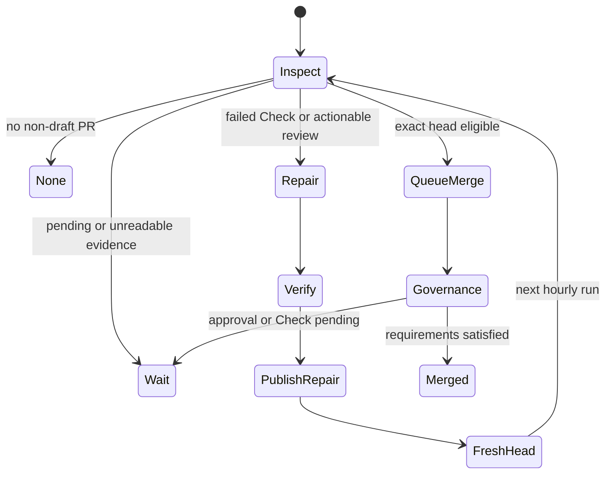

# Hourly governed pull-request steward

## Purpose

The pull-request steward advances one oldest non-draft Four Pillars pull request through review, repair, exact-head verification, and normal GitHub auto-merge. It is independent from the model-free minute-17 product-quality sentinel and the minute-47 zero-open-PR product-development loop.

The steward cannot approve itself, bypass branch protection, force push, merge administratively, tag, release, or deploy. It either updates the existing same-repository PR branch with one verified repair commit or queues ordinary squash auto-merge under existing review and Check requirements.

## Schedule and single-flight behavior

The workflow runs at minute 7 each hour and supports manual dry-run dispatch. Non-cancelling concurrency ensures a later schedule does not interrupt a verifier or publisher. Each run selects no more than one oldest non-draft PR.



A draft PR never blocks inspection of older non-draft work because inventory filters drafts before selecting the oldest candidate. An external-fork PR can be reviewed but is not automatically repaired; publication authority is repository-scoped and cannot safely claim a contributor fork.

## Required repository configuration

- Secret `NVIDIA_NIM_API_KEY` for the OpenCode repair proposer only.
- Existing variable `FOUR_PILLARS_MAINTAINER_APP_CLIENT_ID`.
- Existing secret `FOUR_PILLARS_MAINTAINER_APP_PRIVATE_KEY`.
- The maintainer App installation must retain the established contents and pull-request permissions. Do not rename or reuse reviewer-agent secrets.
- GitHub Actions and artifact APIs must be readable by the workflow.
- Branch protection, required review, required Check, and unresolved-conversation settings remain repository policy.
- `COPILOT_GITHUB_TOKEN` is prohibited.

Missing credentials, unreadable inventory, malformed GraphQL data, unavailable artifacts, or changed head/base identity produce `wait` or a failed closed job. They never select merge or publication.

## Inspector

The inspector receives no model or publication secret. It reads one PR, exact head/base, submitted review decision, unresolved review threads, and latest Check runs. It writes an allow-listed raw JSON file and invokes `scripts/prepare_pr_steward_evidence.py` to produce canonical owner-only JSON.

Evidence is limited to 128,000 source bytes, 100 reviews/threads/Checks, 4,000 bytes per item body/summary, and 20,000 bytes for the PR body. Unsupported controls, bidirectional overrides, unknown keys, malformed SHAs, non-HTTPS GitHub URLs, symlinks, and non-regular files are rejected.

The inspector chooses:

- `none` when no non-draft PR exists;
- `wait` when Checks are pending, inventory is incomplete, the branch is external, or required credentials are absent;
- `repair` when a latest exact-head Check failed, review decision is `CHANGES_REQUESTED`, or an unresolved thread remains;
- `queue_merge` only when no pending/failing Check, requested change, or unresolved thread remains.

The inspector posts at most one exact-head CodeRabbit review request marker. It never changes the reviewer Agent’s credentials or provider configuration.

## Repair proposer

The proposer checks out the exact PR SHA without persisted credentials and downloads the bounded evidence artifact by numeric ID. It installs the repository’s hash-pinned CI environment and the checksum-pinned OpenCode archive used by the existing product-development workflow.

Only the OpenCode process receives `NVIDIA_NIM_API_KEY`. Before execution, the shell removes GitHub, OIDC, Actions runtime/cache, command-file, reviewer, and publication variables. OpenCode web access, external directories, task delegation, GitHub CLI, remote Git, commit, push, tag, release, and deployment commands are denied.

The repair prompt permits exactly one bounded fix for supplied review/Check evidence. It prohibits unrelated feature work and asks for tests, docstrings, docs, CHANGELOG, APA 7 doctoring, database naming, standalone/MSA compatibility, and realistic domain validation only where the repair affects those contracts.

A proposal is rejected when it contains no change, more than 40 files, more than 500,000 patch bytes, a symlink, a gitlink, an invalid staged diff, or a missing repair message.

## Fresh verifier

The verifier receives neither model nor App credentials. It downloads the exact patch artifact by numeric ID and independently validates:

- artifact name, workflow-run identity, non-expiry, and server digest;
- patch SHA-256;
- exact source head/base metadata;
- changed-file and byte counts;
- no symlink or gitlink modes;
- clean `git apply --check` and staged diff.

After applying the patch, one shell unsets every GitHub/OIDC/Actions runtime and command-file channel before running the complete gate:

```bash
python -m pip check
python scripts/product_gap_audit.py
ruff check .
python -m compileall -q src tests scripts
python scripts/check_docs.py
python scripts/check_prompts.py
pytest -m 'not nim_live' -W error::ResourceWarning --cov=four_pillars --cov-report=term-missing
python -m build --no-isolation
docker build --pull=false -t four-pillars-pr-steward-verify .
```

The staged patch digest must remain identical after verification. Any generated or modified untracked file fails the job.

## Non-executing publisher

The publisher checks out the same exact PR head, preserves trusted parsing utilities, downloads and validates the same immutable artifact, and applies it without importing, testing, building, or executing proposed code. Only then does it mint the existing repository-scoped maintainer App token.

Immediately before publication it requires:

- PR state still open and non-draft;
- same repository and same head branch;
- live head SHA equal to inspected SHA;
- live base SHA equal to inspected base SHA;
- no existing branch ownership change;
- a normal fast-forward push without force.

It creates one repair commit with hooks disabled. It never merges in the repair run. The next exact head must receive fresh review and Checks.

## Governed merge runner

The merge runner does not use NVIDIA NIM or execute proposed code. It mints the App token late, then re-queries exact head/base, Checks, review decision, and unresolved threads. When the inspector’s identity is still current and no failure remains, it runs normal squash auto-merge without `--admin`.

Auto-merge remains pending until repository governance is satisfied. A missing independent approval or pending required Check is not a reason to weaken policy. The next hourly run may inspect other state, rerun a failed workflow once, or leave the PR waiting.

## Failure and recovery

| Failure | Result | Recovery |
|---|---|---|
| PR/GraphQL/Check inventory unavailable | Fail closed or `wait` | Retry next hour; inspect GitHub status and token permissions. |
| CodeRabbit unavailable or rate-limited | `wait` under required-review policy | Preserve exact-head marker and retry without changing review identity. |
| OpenCode model failure | No patch published | Next run tries the bounded configured fallback list. |
| Verification failure | Artifact retained for one day; no push | Fix prompt/evidence contract or resolve repository failure, then rerun. |
| Head or base advances | Publisher/merge runner exits | Fresh inspection on the new identities. |
| External fork | No automated repair push | Maintainer comments evidence; contributor or authorized maintainer updates fork. |
| App credential unavailable | No publication or merge | Repair App installation/secret; never substitute a reviewer token. |
| Auto-merge unavailable | No direct administrative merge | Enable repository auto-merge or merge manually under normal governance. |

Failed Checks are evidence, not blockers to all work. The steward may rerun an infrastructure failure once and continue documentation, issue triage, or the next scheduled inspection, but it never treats a rerun as a fix.

## Disablement and rollback

Disable the schedule by removing only `.github/workflows/hourly-pr-steward.yml` in a reviewed PR. The service, CLI, deterministic calculations, API, worker, database, prompts, and artifacts continue to operate independently.

Before rollback, allow any active verifier or publisher to finish; concurrency is non-cancelling. Remove repository variables/secrets only after both the product-development and PR-steward workflows are disabled. Do not revoke or rename existing reviewer-agent credentials as part of steward rollback.

Rollback never rewrites PR branches. Repair commits remain normal auditable Git history and can be reverted through ordinary pull requests.

## Residual risks

See `docs/doctoring/hourly-pr-steward.md`. Primary residual risks are ephemeral-runner egress, malicious tests consuming resources, prompt injection in review evidence, App credential compromise, API/review-agent outages, and incomplete test coverage of behavior. The controls reduce exposure but do not establish correctness or certification.
