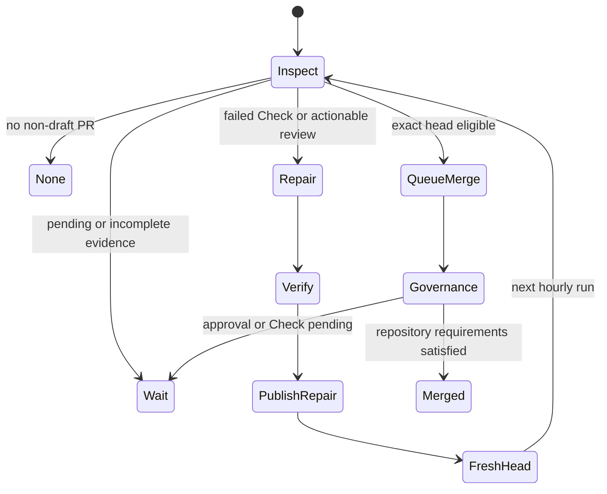

# Hourly exact-head pull-request steward

## Purpose

The pull-request steward advances one oldest non-draft Four Pillars PR through
review triage, bounded repair, exact-head verification, and normal GitHub
auto-merge. It is independent from the model-free minute-17 product-quality
sentinel and the minute-47 zero-open-PR product-development loop.

The steward cannot approve itself, dismiss review, bypass branch protection,
force push, merge administratively, tag, release, or deploy. It either publishes
one verified normal repair commit to a same-repository branch or queues ordinary
squash auto-merge under existing review and Check requirements.

## Schedule and reusable single-flight behavior

The workflow runs at minute 07 each hour and supports `workflow_dispatch` and
`workflow_call`. Non-cancelling concurrency prevents a later schedule from
interrupting verification or publication. Each run processes at most the oldest
open non-draft PR, ordered by creation time and number.



Draft PRs are excluded from selection. An external-fork PR can be inspected but
cannot be automatically repaired because the repository-scoped App must not
claim a contributor-owned branch.

## Required repository configuration

- Secret `NVIDIA_NIM_API_KEY` for the OpenCode repair proposer only.
- Existing variable `FOUR_PILLARS_MAINTAINER_APP_CLIENT_ID`.
- Existing secret `FOUR_PILLARS_MAINTAINER_APP_PRIVATE_KEY`.
- Existing reviewer-agent identities, secret names, and provider routes remain
  unchanged.
- GitHub Actions, Checks, statuses, artifacts, PR REST, and GraphQL APIs must be
  readable by the workflow.
- Branch protection, required review/Checks, unresolved-conversation policy,
  and repository auto-merge remain normal GitHub governance.
- `COPILOT_GITHUB_TOKEN` is prohibited.

Missing credentials, unreadable inventory, incomplete pagination, malformed
GraphQL data, unavailable artifacts, or changed head/base identity produce
`wait` or a failed closed job. They never produce publication or merge.

## Deterministic selection and decision

`scripts/pr_steward_decision.py` is the trusted standard-library control plane.
It has no network, model, database, queue, or application-runtime dependency.
It provides:

```text
select_oldest_non_draft(...)
validate_evidence(...)
write_canonical_evidence(...)
decide_action(...)
render_repair_prompt(...)
```

The strict `1.0.0` evidence document includes only:

- repository and generation timestamp;
- PR number, creation time, draft flag, head/base repositories, refs, and SHAs;
- mergeability, merge-state status, and review decision;
- submitted review states;
- review threads and current/resolved/outdated state;
- exact-head Check runs/status contexts;
- explicit API inventory errors.

The decision order is fail closed:

1. API/schema/pagination uncertainty → `wait`.
2. conflict or external-fork repair → `wait` with an explicit reason.
3. latest change request, current unresolved thread, or failed/error Check →
   `repair` only for a same-repository branch.
4. pending/missing/unknown Checks, required review, `BEHIND`, `BLOCKED`, or
   unknown mergeability → `wait`.
5. only an unchanged clean exact head with successful/neutral/skipped Checks and
   no actionable review → `queue_merge`.

Elapsed time is never evidence of success.

## PII and evidence handling

Blanket PII masking is not applied to source, Korean diagnostics, review text,
or stack traces because it would make repairs unreliable. Instead the inspector
collects only repository-maintenance evidence and excludes birth inputs, user
context, generated reports, report artifacts, model traces, email addresses,
secrets, environment values, and unrelated issues.

Canonical evidence is UTF-8, owner-only, strict-schema, Unicode-normalized,
control/bidirectional-cleaned, URL/identifier allow-listed, item/byte-bounded,
and retained for one day. Failed-job logs remove credential-looking assignment
lines before they enter the model prompt. Reviews and logs are labelled
**UNTRUSTED REVIEW AND CHECK EVIDENCE** and are never shell instructions.

## Repair proposer

The proposer checks out trusted control code at the inspected base, preserves the
decision engine outside the proposal tree, then checks out the exact PR head with
`persist-credentials: false`. Hash-pinned CI dependencies are installed before
the NIM secret is exposed.

Only the OpenCode process receives `NVIDIA_NIM_API_KEY`. Before execution the
shell removes GitHub, OIDC, Actions runtime/cache, command-file, reviewer, and
publication variables. OpenCode web access, external directories, task
delegation, GitHub CLI, remote Git, commit, push, tag, release, and deployment
commands are denied.

The repair may address only supplied review/Check failures. It must preserve
standalone and modular MSA contracts, deterministic calculation evidence,
public docstrings, 100% production statement/branch coverage, database naming,
and affected docs/CHANGELOG/doctoring.

A repair is rejected when it is empty, exceeds 40 files or 500,000 patch bytes,
contains a symlink/gitlink, changes the steward's own workflow/decision/tests or
runbook/doctoring control plane, or fails `git diff --cached --check`.

## Fresh verifier

The verifier receives neither model nor App credentials. It downloads the exact
repair by numeric artifact ID and independently validates:

- artifact workflow-run identity, expiry, and server digest;
- patch SHA-256;
- exact source head/base metadata;
- changed-file and byte counts;
- absence of symlink or gitlink modes;
- clean `git apply --check --binary` and staged diff.

After application, GitHub/OIDC/Actions runtime and command-file channels are
unset before the complete Python 3.11 and 3.12 gates:

```bash
python -m pip check
python scripts/product_gap_audit.py
ruff check .
python -m compileall -q src tests scripts
python scripts/check_docs.py
python scripts/check_prompts.py
pytest -m 'not nim_live' -W error::ResourceWarning --cov=four_pillars --cov-report=term-missing
python -m build --no-isolation
docker build --pull=false -t four-pillars-pr-steward-verify .
semgrep scan --config auto --error  # when locally available; exact-head SAST remains required
```

The staged patch digest must be unchanged after verification. Generated or
untracked files fail the job. Repository-required Security Scan and SAST Semgrep
must still pass on the published exact head; local scanning never substitutes
for those Checks.

## Non-executing publisher

The publisher checks out the exact pre-repair head, preserves trusted control
code, validates and applies the same patch, but never imports, tests, builds, or
executes proposed code. It then mints the established repository-scoped
Maintainer App token.

Immediately before publication it requires:

- PR remains open and non-draft;
- PR remains the oldest non-draft queue item;
- head repository and branch ownership remain unchanged and local;
- live head SHA equals the inspected head;
- live base SHA equals the inspected base;
- remote branch still points to the inspected head;
- push is a normal fast-forward without force.

One repair commit is created with hooks disabled. No merge occurs in the repair
run; the new head receives fresh review and all exact-head Checks.

## Governed merge runner

The merge runner receives no NVIDIA NIM credential and executes no proposed
code. It mints the App token late, re-queries PR identity, review decision,
review threads, status-check rollup, oldest queue position, and exact head/base.
The deterministic engine must return `queue_merge` again for the unchanged head.

Only then does it request:

```bash
gh pr merge <number> --squash --auto --match-head-commit <head_sha>
```

Auto-merge remains pending until repository governance is satisfied. The runner
never uses `--admin`, submits approval, dismisses review, force pushes, tags,
releases, or deploys.

## Failure and recovery

| Failure | Result | Recovery |
|---|---|---|
| PR/GraphQL/Check inventory unavailable | `wait` or fail closed | Retry next hour; inspect GitHub status and read permissions. |
| Review agent unavailable/rate-limited | `wait` under review policy | Retry without changing reviewer identity or key chain. |
| OpenCode/NIM candidate failure | No patch published | A later bounded run may retry the configured NIM candidates. |
| Verification failure | One-day artifact, no push | Fix contract/evidence or repository failure; never reinterpret failure as success. |
| Head, base, or queue order advances | Publisher/merge exits | Re-inspect the new exact identities. |
| External fork requires repair | No automated push | Contributor or authorized maintainer updates the fork. |
| Maintainer App unavailable | No publication/merge | Repair App installation or secret; never substitute reviewer credentials. |
| Auto-merge unavailable | No direct administrative merge | Restore repository auto-merge or merge manually under normal governance. |

A failed Check is evidence, not a reason to stop all development. Other bounded
analysis and issue preparation can continue, but the exact failing head is never
merged until repaired and revalidated.

## Standalone, modular MSA, disablement, and rollback

The workflow operates independently in this repository and supports
`workflow_call` for central `.github`, `naruon`, or another MSA controller. The
decision engine can be reused without importing Four Pillars application state.
Repository-specific quality commands remain an explicit adapter boundary.

Disable the schedule by removing only
`.github/workflows/hourly-pr-steward.yml` in a reviewed PR. The service, CLI,
calculation core, API, worker, database, prompts, and report artifacts continue
to operate. Do not revoke or rename reviewer credentials during rollback.
Normal repair commits remain auditable and can be reverted through ordinary PRs.

## Compliance and residual risk

The workflow's least privilege, change-management history, exact artifact
integrity, one-day retention, security testing, and audit logs are designed to
support future CSAP and SOC 2 evidence collection. They are not certification or
attestation. See `docs/doctoring/hourly-pr-steward.md` for APA 7 sources, PII
strategy, current standards status, claim limits, and residual risks.
