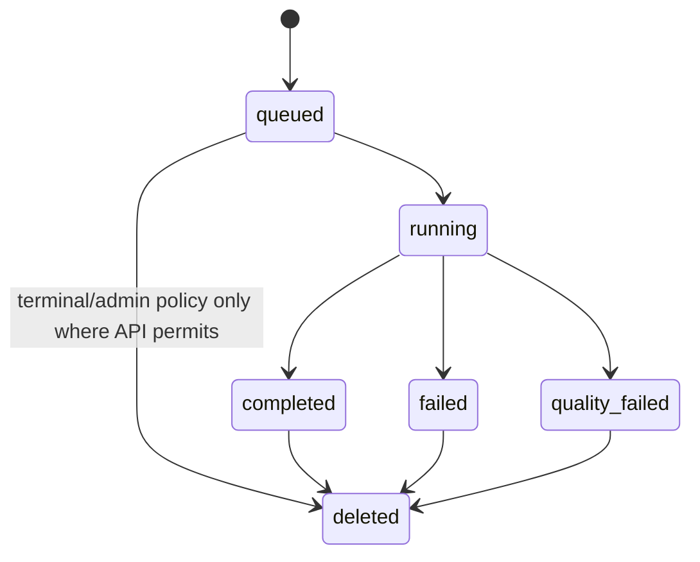

# Four Pillars Operability Contract

**Scope:** standalone edition plus obligations for replaceable MSA adapters.  
**Maturity:** existing single-node operations are `implemented_on_protected_main`; multi-node controls are `planned` until implemented.

## 1. Operational principles

1. Calculation availability is independent from hosted-model availability.
2. Durable report jobs are observable through explicit lifecycle state rather than inferred from HTTP connection lifetime.
3. A completed job means quality-approved artifacts were published successfully.
4. Sensitive content is not copied into ordinary telemetry to make debugging easier.
5. A selected interpretation backend fails visibly; there is no silent provider fallback.
6. Recovery actions must preserve idempotency, evidence integrity, and authorization.
7. Standalone SQLite/filesystem assumptions must not be silently presented as multi-node guarantees.

## 2. Service-level indicators (SLI)

Production deployments should collect, at minimum:

- API request success/error rate by endpoint class without subject payload labels;
- deterministic calculation latency and failure rate;
- queue depth and oldest queued-job age;
- job lifecycle counts and terminal-failure classifications;
- worker claim/processing duration;
- selected-backend request attempts, retries, schema repairs, and terminal errors;
- quality-failure rate;
- artifact publication duration/failure rate;
- history and artifact retrieval latency/error rate;
- cleanup/retention deletion success and failure counts;
- storage/database health and capacity;
- deployment/release version and exact commit/provenance identity.

## 3. Initial SLO guidance

These targets are product/operator objectives, not universal contractual SLAs:

| SLO | Initial objective |
|---|---|
| deterministic calculation availability | >= 99.9% monthly excluding planned maintenance in a production deployment |
| deterministic calculation latency | p95 < 250 ms for representative supported modern-date inputs on the reference single-core profile |
| unclassified report-job terminal failures | < 1% of report-generation jobs |
| durable enqueue data loss | 0 accepted jobs lost under supported single-node restart scenarios |
| history privacy regression | 0 confidential request/report fields in collection responses/cursors |
| manifest/artifact integrity mismatch | 0 published completed jobs |
| retention cleanup silent success on failure | 0; failures must be observable |

Hosted model latency/availability should be reported separately from calculation/API availability because it is provider-dependent.

## 4. Health and readiness

- **Liveness/health** proves the API process is responding.
- **Readiness** must prove the application can read its authoritative job repository and perform the minimum artifact-storage operation required by the supported deployment mode.
- A model provider outage should not make calculation-only endpoints unready unless the deployment intentionally routes all traffic through a report-generation-only service.
- Readiness must not emit credentials, raw paths, birth data, report text, or other confidential content.

## 5. Job lifecycle operations

A process crash can leave a job in `running`. The current standalone product deliberately leaves such state visible for operator inspection rather than automatically assuming the work is abandoned. Any requeue/recovery command must prove ownership/lease semantics before changing a running job.

## 6. Retry and provider behavior

Direct NIM and Contextual Orchestrator clients retry only bounded transient classes defined by the implementation contract. Permanent 4xx/auth/config errors fail immediately. Model retry, schema repair, and editorial repair are separate budgets and must remain visible in private operational evidence.

Do not hide an unavailable selected backend by changing providers. A user/operator must be able to distinguish model/provider failure from deterministic calculation, schema, quality, rendering, and storage failures.

## 7. Backup and restore

### Standalone edition

Back up together, at a consistent operational point:

- SQLite database and required WAL state using a SQLite-safe backup procedure;
- published artifact root;
- deployment configuration **excluding plaintext secrets from ordinary backup bundles**;
- release/version/provenance information necessary to run a compatible application version.

A filesystem copy of an active SQLite database without a supported snapshot/backup mechanism is not sufficient evidence of a recoverable backup.

### Restore acceptance

A restore drill should prove:

1. database opens and schema initializes without unintended migration loss;
2. a sample of terminal job rows maps to expected artifacts;
3. manifest hashes validate for sampled completed jobs;
4. queued/running rows are handled according to an explicit recovery procedure;
5. application authentication and secret management are re-established separately;
6. deletion/retention policies resume after restore.

### Multi-node edition

A `planned` multi-node adapter must define database PITR/snapshot, queue recovery, object-store version/lifecycle, cross-resource consistency, RPO/RTO, region/residency, encryption keys, restore order, and rollback before production support is claimed.

## 8. Retention and deletion

Default report retention is 30 days unless deployment policy specifies another bounded duration. Explicit deletion and scheduled retention must cover both durable job state and published artifacts through their authoritative adapters.

Operational requirements:

- retention policy is configuration/auditable deployment policy, not a hidden constant in operator procedure;
- deletion failure is observable and retryable;
- backup retention/expiry is documented separately from live-store deletion;
- restored backups do not silently resurrect data outside documented retention without subsequent cleanup;
- support logs and incident evidence apply independent minimum-necessary retention.

## 9. Incident response

Operational incidents include at least:

- deterministic calculation regression;
- confidential-data/history/attribution leak;
- credential exposure or provider misuse;
- queue corruption or duplicate-cost incident;
- partial/incorrect artifact publication;
- model/provider outage or schema-quality regression;
- release/provenance or dependency compromise;
- scheduled autonomous-development/review authority violation;
- deletion/retention failure.

For each incident capture exact version/commit, time window, affected data/control boundary, first failing component, containment, recovery, customer/operator impact, evidence needed for notification decisions, regression test/control added, and follow-up owner. Avoid copying full sensitive prompts/reports into incident tickets unless strictly necessary and access-controlled.

## 10. Observability and privacy

Telemetry labels may include service, version, endpoint class, job status, backend name, model identifier, retry/repair counts, error class, region/deployment identity, and latency buckets where approved.

Telemetry must not include birth date/time, subject labels, relationship/work notes, report text, prompt bodies, request JSON, credentials, artifact filesystem paths, idempotency keys, or other context that is not required for the operational measurement purpose.

This is purpose limitation, not blanket masking: the application still processes required personal inputs inside the calculation/report trust boundary.

## 11. Capacity and backpressure

The standalone SQLite/worker architecture should run a bounded worker count compatible with one-node database/filesystem semantics. Operators should alert on queue age/depth before increasing concurrency blindly.

Capacity planning separates:

- deterministic CPU calculation;
- model request concurrency/quota;
- schema/editorial repair amplification;
- PDF/rendering CPU/memory;
- artifact storage growth;
- database history/retention size.

Any future horizontal worker scale requires a repository/queue adapter with atomic distributed claim semantics rather than sharing SQLite over an unsupported network filesystem.

## 12. Deployment and rollback

A production deployment must identify an exact application version/commit and compatible schema/calculation/prompt versions. Rollback must account for whether a newer version migrated durable data or produced artifacts whose schema older code cannot read.

Current in-place SQLite migrations are additive for idempotency/history fields. Future destructive/non-backward-compatible migrations require a separate migration/rollback ADR and tested backup/restore path.

## 13. Security/compliance readiness

Evidence useful for CSAP/SOC 2 procurement readiness may include change/release governance, least privilege, vulnerability management, backup/restore drills, retention/deletion, incident response, access review, secret rotation, provider/subprocessor inventory, and audit trails. These are design/evidence targets only; actual certification requires the deployed organization and control environment to be assessed.

## 14. Operator checklist

Before declaring a release operationally ready:

- exact protected-main/release version is known;
- database/artifact capacity is sufficient;
- health/readiness probes pass;
- selected interpretation backend credentials and egress are intentionally configured;
- backup and sampled restore evidence is current;
- retention/deletion jobs are healthy;
- alerts cover queue age, job failures, storage and cleanup failures;
- provider/subprocessor/data-residency expectations are documented;
- rollback procedure is compatible with current durable schema;
- release provenance/checksums and security gates are available.

## References — APA 7th

International Organization for Standardization. (2023). *ISO/IEC 25010:2023 Systems and software engineering—Systems and software Quality Requirements and Evaluation (SQuaRE)—Product quality model* (2nd ed.). ISO.

Scarfone, K., Souppaya, M., & Dodson, D. (2022). *Secure Software Development Framework (SSDF) Version 1.1: Recommendations for mitigating the risk of software vulnerabilities* (NIST SP 800-218). National Institute of Standards and Technology. https://doi.org/10.6028/NIST.SP.800-218
