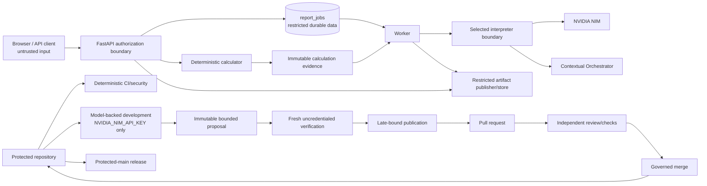

# Four Pillars Repository Threat Model

- Status: Current repository-scoped threat model for protected-main architecture; Proposed automation is labelled explicitly
- Repository baseline: `ContextualWisdomLab/four-pillars`
- Protected-main version reviewed: `cd4f4e6361238a1db43c28540640a407c7bf7c6e`
- Reviewed: 2026-08-09

## 1. Security objective

Four Pillars processes personal birth/context data, deterministic calculation evidence, generated reports, provider credentials, durable job state, artifacts, and privileged repository automation. The primary security objective is to preserve **calculation integrity, personal-data confidentiality, job/artifact authorization, model/provider isolation, release provenance, and separation of development/review/merge/release authority** without making the authorized product path unusable through blanket masking.

This model describes threat classes and invariants; it does not assert a vulnerability in any current diff and does not establish CSAP/SOC 2/ISO certification.

## 2. Assets

### Product/runtime assets

- birth date/time, timezone/location policy, subject label and optional context;
- deterministic four-pillar/luck output and calculation fingerprint/version;
- prompts, schemas and prompt/model provenance;
- generated report JSON/HTML/PDF and privacy-safe trace metadata;
- durable `report_jobs` lifecycle, request fingerprints and idempotency-key digests;
- report-history cursor semantics;
- artifact directory/object identity and SHA-256 manifest;
- API authentication material and future tenant/account identity linkage;
- direct NVIDIA NIM and Contextual Orchestrator credentials.

### Repository/control-plane assets

- protected `main` and release tags;
- pull-request head/base refs;
- CI/security/check evidence and independent reviews;
- GitHub App/source-write/merge/release credentials;
- `NVIDIA_NIM_API_KEY` used by model-backed development/evaluation;
- immutable automation proposal/repair artifacts and digests;
- release wheel/sdist/container/checksum/provenance evidence;
- authoritative PRD/TRD/ADRs/UML/ERD/security/operations documentation.

## 3. Trust boundaries

No trust crosses automatically because two components run in the same network, process, cloud account, repository organization, or GitHub Actions environment.

## 4. Attacker-controlled or untrusted inputs

- public API/CLI/browser birth/context fields;
- calendar/timezone/geographic policy values permitted by schemas;
- idempotency keys, history cursors, job IDs and artifact path parameters;
- HTML-visible subject/context strings;
- model-generated JSON/prose and provider HTTP errors;
- Contextual Orchestrator responses and routing/provider metadata that is not application-owned evidence;
- stored report request data read after restart;
- uploaded/committed source changes in a pull request;
- model-authored autonomous patch/PR metadata;
- PR comments/review bodies/thread text/check names/statuses/log excerpts consumed by repository automation;
- GitHub artifact metadata, branch/ref state and delayed/stale workflow evidence;
- future remote repository/object-storage/database responses.

Untrusted does not mean malicious in every case; it means the boundary validates rather than assuming correctness/authority.

## 5. Core security invariants

### Calculation integrity

1. AI cannot create/replace year, month, day or hour pillars, Ten Gods, hidden stems, Twelve Growth stages, luck periods, solar-term boundaries or the calculation fingerprint.
2. Boundary-critical calendar arithmetic remains deterministic and independently fixture-tested.
3. A calculation-policy change that can change output changes the evidence version and is release-visible.

### Authorization and privacy

4. A job UUID/cursor/path is not authorization.
5. Public report history excludes the stored request and protected report/model data.
6. Personal data enters only purpose-required calculation/report boundaries, not routine telemetry/usage attribution/public identifiers.
7. Credentials never become prompts, report content, public traces, filenames, issues or PR metadata.
8. Missing/ambiguous authorization fails closed rather than widening scope.

### Model/provider integrity

9. Direct NIM and Contextual Orchestrator have separate credentials and explicit selection.
10. A selected backend failure never silently switches provider/privacy class.
11. Model output passes schema and deterministic/editorial quality validation before publication.
12. LLM-as-a-judge never overrides deterministic evidence or becomes the sole release/security decision.

### Queue/artifact integrity

13. Durable create/claim/idempotency semantics are atomic under the selected repository adapter.
14. Same idempotency key with another payload is rejected.
15. Artifact access is allow-listed and resolved within the authorized job boundary.
16. Partial output is not published as completed; manifests bind calculation/model/prompt/file hashes.

### Repository governance

17. Model-backed development has no reviewer/merge/release authority.
18. Existing independent reviewer identities and credential chains remain distinct.
19. Source mutation/merge uses freshly revalidated exact refs/evidence rather than remembered or synthetic state.
20. A queued/stale/skipped/cancelled/rate-limited/failed check/review is not passing evidence.
21. Release artifacts bind to integrated protected-main source and immutable version identity.

## 6. Threat classes and mitigations

| Threat class | Example attack/failure | Existing/required mitigations | Residual risk/gap |
|---|---|---|---|
| Injection / prompt control | user context tries to override system/calculation rules | untrusted-context envelope; versioned prompts; deterministic quality gate | model may still follow adversarial prose in non-deterministic guidance; evaluation/human review remain necessary |
| Deterministic evidence tampering | model/consumer substitutes a different pillar | typed models, fingerprint, allowed-pillar checks, KASI/NAOJ fixtures | compromised source/release could alter both code and tests; independent review/provenance required |
| IDOR / cross-job access | attacker guesses UUID or changes artifact path | authentication, opaque UUID, allow-listed artifact names, resolved path boundary | true multi-tenant subject authorization not yet implemented |
| Stored PII leakage | raw request/report appears in history/logs/attribution | redacted public view, safe trace/attribution, purpose-bound governance | production centralized logs, backup and support access need explicit deployment controls |
| Secret leakage | provider/API/App key reaches model/log/artifact | separate secret names/scopes, environment boundaries, secret scanning, no prompt embedding | runner/process compromise remains possible; short-lived/least-privilege controls reduce blast radius |
| Backend confusion | NIM outage silently routes elsewhere | explicit enum/factory and no fallback | gateway itself may route among approved providers; deployment must govern processors/regions |
| SSRF / unsafe endpoint | configured backend points to untrusted HTTP host | HTTPS required remotely; loopback HTTP only for explicit local dev; validated URLs | deployment DNS/network egress still needs infrastructure enforcement |
| Path/symlink traversal | artifact request escapes job directory | allow-list, resolved-root checks, symlink defenses | future object-store adapter must preserve equivalent semantics |
| Queue replay/duplication | retries create duplicate model jobs/cost | RFC8941-style bounded idempotency key, key digest + canonical request fingerprint, unique index | distributed adapter must preserve atomicity |
| Cursor manipulation | crafted cursor leaks/enumerates state | strict version/canonical base64url/UTC/UUID validation, bounded length | cursor does not replace resource authorization |
| XSS / unsafe report content | subject/model output injected into HTML/browser | HTML escaping; safe DOM text APIs; no raw innerHTML for API data | PDF/HTML renderer dependencies remain supply-chain surfaces |
| Stale GitHub evidence | merge after head/base/check/review changed | exact-head expected SHA, ref/base/review/thread/check re-fetch, fail closed | asynchronous state always creates TOCTOU risk; revalidation is mandatory at mutation boundary |
| Model-authored supply-chain mutation | autonomous agent edits workflow to grant itself authority | separate runners, immutable patch, prohibited Git modes, late publisher credentials, independent review | verifier executes proposed code and has ordinary egress; constrained runner/network sandbox can be strengthened |
| Artifact substitution | workflow artifact altered/swapped | artifact ID/name/run/digest + patch SHA/file/byte count validation | digest proves identity, not semantic safety |
| Malicious PR metadata | title/body controls shell/GitHub publication | trusted parser, strict UTF-8, regular-file identity, control/bidi rejection, byte budgets | GitHub-rendered Markdown still needs normal platform safety assumptions |
| Release replacement | overwrite existing tag/assets with new bits | idempotent version publication, exact target SHA, new SemVer for corrections | current release lacks mandatory signed provenance/SBOM |
| Dependency/action compromise | malicious package/action version | hashed CI dependencies, action commit SHAs, package/container/security checks | upstream ecosystem compromise remains possible; SBOM/signing/provenance backlog |
| Privileged-insider misuse | operator reads raw report content without need | target purpose-bound break-glass/audit/least-privilege design | break-glass/tamper-resistant audit not yet implemented in production profile |
| Availability exhaustion | job/provider retry floods queue/API | bounded retry/timeouts, durable queue, worker separation | rate limits, quota, multi-node capacity/SLO controls remain deployment concerns |

## 7. Abuse cases

### A. Prompt tries to rewrite a birth chart

The model receives calculation evidence but returns a different month pillar. Pydantic structure alone is insufficient; deterministic quality validation must reject the contradiction and the job cannot complete with the modified evidence.

### B. Authenticated user guesses another job UUID

Possession of UUID is not authorization. In current single-credential deployments, the API credential is the boundary; an enterprise tenant deployment must additionally enforce tenant/subject association before exposing the artifact. This gap prevents claiming complete multi-tenant readiness.

### C. Operator disables masking for debugging

There should be no ambient masking toggle on which privacy depends. Routine logs remain content-minimized. If raw content is necessary, a future privileged break-glass workflow grants narrowly scoped/time-bounded access with actor/reason/outcome audit.

### D. Model development runner asks GitHub CLI to merge its PR

The model runner has no merge/reviewer/release credential and OpenCode command policy denies privileged GitHub mutation. Publication is a later trust zone; independent reviews/checks and governed merge remain separate.

### E. A PR turns green, then its head moves

Green evidence belongs to the old SHA. The new head must be refetched and reverified; expected-head merge must refuse stale SHA evidence.

## 8. Assumptions

- GitHub and configured cloud/model services enforce their documented identity/token primitives; Four Pillars still uses least privilege and does not treat those platforms as semantically trusted input sources.
- Host/container/secret-store/network hardening is deployment-specific; source defaults cannot prove an operator configured infrastructure safely.
- KASI/NAOJ fixture transcription/source provenance has normal reviewed-source integrity; future changes require explicit review.
- Organization deployments define legal/contractual purpose, consent/basis, residency and processor obligations externally to the repository.

## 9. Security test/evidence priorities

1. preserve existing path, auth, cursor, idempotency, redaction, endpoint and credential tests;
2. add cross-tenant negative tests before multi-tenant support is advertised;
3. add backup/delete/export and break-glass tests with production reference profiles;
4. strengthen autonomous verifier egress/sandbox controls where practical;
5. publish/verify SBOM and provenance/signatures for release artifacts;
6. run protected-main scheduler operational acceptance after control-plane changes;
7. keep external calculation fixtures independent of product code;
8. periodically review generated-report/browser security with realistic hostile Unicode/HTML/context values.

## 10. References and related decisions

- ADR 0001 — deterministic calculation/AI authority.
- ADR 0003 — explicit Contextual Orchestrator/no fallback.
- ADR 0004 — purpose-bound personal-data controls (Proposed).
- ADR 0007 — autonomous control-plane authority (Proposed).
- ADR 0008 — external solar-term evidence/versioning (Accepted).
- ADR 0009 — release provenance/operational acceptance (Proposed).
- `docs/security/DATA_GOVERNANCE.md`.
- `docs/compliance/CSAP_SOC2_READINESS.md`.
- `docs/standards/TRACEABILITY.md`.

Repository: ContextualWisdomLab/four-pillars
Version: cd4f4e6361238a1db43c28540640a407c7bf7c6e
