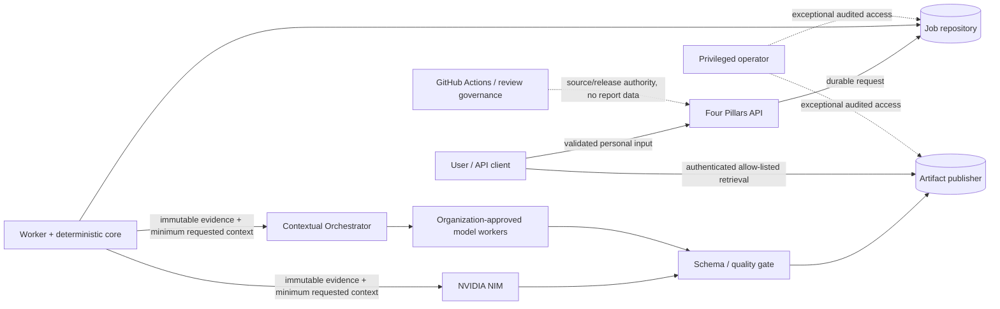

# Four Pillars Threat Model

**Scope:** standalone product and modular MSA integration.  
**Maturity:** current protected-main controls plus accepted architecture; PR #29 automation is `active_pr`, not shipped.

## 1. Security objectives

Four Pillars must preserve:

- integrity of deterministic chart/luck evidence;
- confidentiality and purpose limitation for personal birth/context/report data;
- separation of model/provider credentials and application authentication;
- explicit interpretation-recipient selection with no silent provider fallback;
- authenticated artifact and history access;
- availability/recoverability of the durable job lifecycle;
- exact-head provenance and least-privilege autonomous-development governance;
- auditable incident response without dumping sensitive content into telemetry.

The product is designed toward CSAP and SOC 2 readiness concerns where applicable, but this document is not evidence of certification or an attestation.

## 2. Assets and data classification

| Asset | Classification | Principal risk |
|---|---|---|
| birth date/time/timezone/location-derived time context | confidential personal data | identity/context disclosure, unauthorized secondary use |
| relationship/work/life notes | confidential personal data | sensitive-context disclosure |
| deterministic chart/luck evidence | confidential + integrity-critical | tampering or silent reinterpretation |
| generated report | confidential user content | unauthorized disclosure or harmful certainty |
| `request_json` | confidential durable job input | database/operator compromise |
| job UUID/status/timestamps | operational metadata | enumeration/correlation if improperly exposed |
| calculation/request fingerprints | integrity metadata | unintended linkage if exposed broadly |
| model/prompt/version trace | provenance metadata | route/intellectual-property disclosure |
| `NVIDIA_NIM_API_KEY` | secret | hosted-model abuse and data-exposure path |
| `CONTEXTUAL_ORCHESTRATOR_TOKEN` | secret | organization-gateway abuse |
| application/database credentials | secret | service/data compromise |
| release/CI evidence | integrity-critical | supply-chain or governance bypass |

## 3. Trust boundaries

## 4. Threat catalogue

### T1 — deterministic evidence tampering

**Threat:** an LLM, prompt, adapter, editorial repair, or malicious integration changes pillars, luck periods, solar-term boundaries, or fingerprinted evidence.

**Controls:** deterministic calculation core; typed immutable models; calculation version; SHA-256 fingerprint; quality-gate comparison; independent KASI/NAOJ fixtures; no LLM authority over calculations.

**Residual risk:** deterministic code itself can contain an error, especially at historical/time-scale boundaries. Mitigation is independent fixtures, explicit policy/versioning, and visible boundary warnings rather than LLM correction.

### T2 — prompt injection through user context or model output

**Threat:** user-supplied notes or generated content attempts to alter system instructions, tool/provider routing, validation, secrets, or publication controls.

**Controls:** user context is serialized as untrusted data; system prompt and schema are separate; provider output is untrusted until Pydantic and deterministic/editorial quality validation; no arbitrary model-controlled shell/tool path in report generation; prompt/model provenance is recorded.

**Residual risk:** semantic prompt injection may still influence prose inside the permitted schema. High-impact deterministic decisions remain outside model authority.

### T3 — excessive personal-data masking breaks product behavior

**Threat:** a generic security control masks required birth/time/context fields, making calculation or requested interpretation incorrect or impossible.

**Controls:** ADR 0004 purpose limitation; **blanket masking is explicitly rejected** when it destroys the requested function. The alternative is minimum-necessary disclosure, authorization, retention, encryption, telemetry minimization, and auditable privileged access.

**Residual risk:** hosted interpretation still requires sending some requested context to the selected recipient. Operators must document the recipient/region/retention contract and offer deployment choices appropriate to their obligations.

### T4 — unnecessary or secondary PII disclosure

**Threat:** personal input/report content leaks through history rows, usage attribution, logs, filenames, traces, error details, or support workflows.

**Controls:** redacted authenticated history; opaque UUID paths; allow-listed artifact names; prompt-safe organization attribution; bounded errors; no raw prompt/report in ordinary published trace metadata; retention/deletion; restricted privileged access.

**Residual risk:** full artifacts remain intentionally retrievable by authorized users and operators under the configured storage model.

### T5 — credential confusion or provider pivot

**Threat:** `NVIDIA_NIM_API_KEY` and `CONTEXTUAL_ORCHESTRATOR_TOKEN` are substituted, logged, forwarded to another service, or used to silently fall back to a different provider.

**Controls:** separate settings and authorization headers; explicit backend selection; no silent fallback; hosted-test secrets only on trusted workflows; `COPILOT_GITHUB_TOKEN` prohibited for autonomous product development.

**Residual risk:** deployment secret managers and organization gateway internals remain operator-owned dependencies.

### T6 — API/history/artifact enumeration and path traversal

**Threat:** an attacker guesses job IDs, abuses cursor/artifact names, or escapes artifact roots.

**Controls:** random UUIDs; authentication where configured; strict/versioned opaque cursor; path resolution and allow-listing; no personal data in filenames; safe DOM rendering on the browser client.

**Residual risk:** deployments that disable API authentication must explicitly accept the resulting access model and place an authenticated edge in front of the service.

### T7 — durable queue replay or idempotency abuse

**Threat:** repeated network requests create duplicate expensive NIM jobs or one idempotency key is reused for another payload.

**Controls:** canonical request fingerprint; raw key not persisted; SHA-256 key digest; atomic create; unique partial index; different-payload reuse fails closed.

**Residual risk:** clients that omit an idempotency key retain legacy “new job per request” semantics by design.

### T8 — partial artifact publication

**Threat:** a failed worker exposes incomplete JSON/PDF/manifest content as a completed report.

**Controls:** staged hidden directory/object prefix; quality gate before publication; atomic publisher semantics; `completed` only after publication succeeds; manifest hashes.

**Residual risk:** custom MSA ArtifactPublisher implementations must provide equivalent atomic visibility and must be tested independently.

### T9 — privileged-access misuse

**Threat:** an operator, support engineer, database administrator, or automation principal reads confidential job/report data outside an authorized purpose.

**Controls:** least privilege; role separation; encrypted storage/backup; restricted linkage; purpose-bound access policy; **privileged access** must be exceptional and auditable; break-glass procedures should be time-bounded in enterprise deployments; ordinary debugging must not dump full sensitive content.

**Residual risk:** the standalone filesystem/SQLite edition depends on host OS access controls; enterprise deployments should use managed identity/KMS/audit controls when required.

### T10 — retention/deletion failure

**Threat:** a user/operator believes data is deleted while database rows, artifacts, or backups remain indefinitely.

**Controls:** explicit terminal deletion; default retention; cleanup health/incident handling; adapter contract must surface deletion failure; production backup retention must be documented separately.

**Residual risk:** immediate deletion from immutable/offline backup generations may be technically impossible; the deployment must disclose backup expiration/restoration controls rather than falsely claim immediate erasure.

### T11 — autonomous-development credential or supply-chain compromise

**Threat:** scheduled model development gains GitHub write/review/release authority, steals `NVIDIA_NIM_API_KEY`, modifies its own governance, or publishes unverified code.

**Controls:** checksum/immutable action pinning where practical; model runner separated from verifier/publisher; late-bound scoped GitHub App publication; model has no merge/release/reviewer identity; exact-head/base checks; bounded patches; symlink/gitlink rejection; no `COPILOT_GITHUB_TOKEN`; independent security/review gates.

PR #29's PR steward is `active_pr`; its final authority must be re-evaluated when merged rather than assumed here.

### T12 — false authority in generated interpretation

**Threat:** symbolic interpretation is presented as scientific prediction, diagnosis, treatment, or deterministic life advice.

**Controls:** report quality rules require conditional language, balance, practical non-mystical techniques, disclaimer, rejection of medical directions/event certainty/false authority; LLM judge is supplementary.

**Residual risk:** prose can still be persuasive. User-facing copy must continue to distinguish traditional interpretation from empirically validated decision evidence.

## 5. Security verification

- deterministic golden fixtures and boundary transitions;
- authentication/history/artifact path tests;
- hostile user-context / schema tests;
- secret/config contract tests;
- idempotency concurrency tests;
- HTML escaping and safe browser DOM tests;
- exactly 100% owned production statement and branch coverage;
- package/container/SAST/dependency/security checks;
- exact-head review and release provenance;
- opt-in hosted NIM tests using only `NVIDIA_NIM_API_KEY`.

## 6. Incident response minimums

An incident involving personal data, credentials, deterministic integrity, model routing, or release provenance should record the affected exact version/commit, data classes, recipient/region where known, time window, containment action, credential rotation if applicable, deletion/retention impact, root cause, tests added to prevent recurrence, and user/operator notification obligations. Incident evidence should minimize sensitive content while remaining sufficient for investigation.

## 7. Compliance-readiness mapping

Four Pillars may collect evidence useful for CSAP/SOC 2 or other procurement programs—access control, change governance, vulnerability management, logging, incident response, backup/recovery, vendor/subprocessor records, retention, and secure SDLC—but must not claim certification until an authorized assessment covers the actual deployed organization, infrastructure, policies, and evidence period.

## References — APA 7th

International Organization for Standardization. (2023). *ISO/IEC 23894:2023 Information technology—Artificial intelligence—Guidance on risk management*. ISO.

International Organization for Standardization. (2023). *ISO/IEC 42001:2023 Information technology—Artificial intelligence—Management system*. ISO.

Autio, C., Schwartz, R., Dunietz, J., Jain, S., Stanley, M., Tabassi, E., Hall, P., & Roberts, K. (2024). *Artificial Intelligence Risk Management Framework: Generative Artificial Intelligence Profile* (NIST AI 600-1). National Institute of Standards and Technology. https://doi.org/10.6028/NIST.AI.600-1

Scarfone, K., Souppaya, M., & Dodson, D. (2022). *Secure Software Development Framework (SSDF) Version 1.1: Recommendations for mitigating the risk of software vulnerabilities* (NIST SP 800-218). National Institute of Standards and Technology. https://doi.org/10.6028/NIST.SP.800-218
