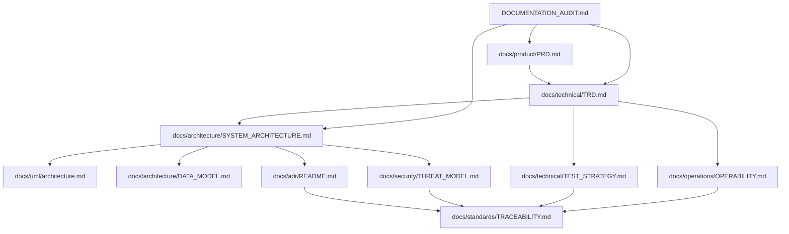

# Four Pillars Documentation Completeness Audit

**Baseline:** protected `main` commit `cd4f4e6361238a1db43c28540640a407c7bf7c6e`  
**Audit date:** 2026-08-09  
**Architecture-description reference:** ISO/IEC/IEEE 42010:2022  
**Product-quality reference:** ISO/IEC 25010:2023

## Maturity vocabulary

Every architecture claim uses one of these labels. A PR body, chat transcript, generated plan, or branch is not allowed to silently upgrade its own maturity.

| Label | Meaning |
|---|---|
| `implemented_on_protected_main` | Directly evidenced by the current protected-main source, tests, or released artifact. |
| `accepted_architecture` | An accepted design invariant or ADR with an implementation/evidence mapping. |
| `active_pr` | Work exists on an open PR but is not yet a product capability. |
| `planned` | Proposed future work; no shipped-behavior claim is permitted. |
| `superseded` | Retained only for historical traceability after a newer decision or implementation replaced it. |

## Executive assessment

The repository already has a substantially better documentation baseline than a typical early-stage service: PRD, TRD, root architecture, UML views, calculation/API/modularity documents, accepted ADRs, security policy, runbook, NIM operations, standards references, and research traceability are all present. The baseline is therefore **substantive but incomplete**, not missing.

The acquisition-grade gaps were architectural discoverability and evidence separation: there was no ADR index, logical ERD/data model, explicit threat model, independent test strategy, independent operability/SLO contract, or maturity model that prevents active-PR plans from being mistaken for protected-main reality. This increment fills those gaps without modifying files currently owned by active PR #29.

## Completeness matrix

| Document family | Baseline assessment | Current action | Target maturity |
|---|---|---|---|
| Product PRD | Strong; covers product users, calculations, LLM/report quality, outputs, browser history, modularity and NFRs. | Add documentation-completeness and purpose-bound privacy requirements. | `implemented_on_protected_main` after merge |
| Technical TRD | Strong; covers trust boundaries, components, data flow, calculation, AI adapters, reliability, security, tests and deployment. | Link canonical ERD, threat model, test strategy, operability and maturity rules. | `implemented_on_protected_main` after merge |
| Root `ARCHITECTURE.md` | Strong protected-main system/control-plane summary. | Do not edit while PR #29 owns the path. Synchronize after PR #29 merges if necessary. | `implemented_on_protected_main` |
| Canonical system architecture | Missing as a viewpoint/concern-indexed architecture description. | Add `docs/architecture/SYSTEM_ARCHITECTURE.md`. | `implemented_on_protected_main` after merge |
| UML | Strong component, class, sequence, deployment and state diagrams. | Preserve; supplement with data-model/trust-boundary diagrams rather than duplicate. | `implemented_on_protected_main` |
| ERD / logical data model | Missing. | Add `docs/architecture/DATA_MODEL.md` from actual `report_jobs` schema and artifact/port contracts. | `implemented_on_protected_main` after merge |
| ADRs | Three substantive decisions exist, but no authoritative index/supersession policy. | Add ADR index and cross-cutting privacy/document-authority ADRs. | `implemented_on_protected_main` after merge |
| Threat model | Security policy exists, but threats/actors/assets/trust zones/residual risks are not independently modeled. | Add `docs/security/THREAT_MODEL.md`. | `implemented_on_protected_main` after merge |
| Test strategy | TRD has a strong testing section; no independently auditable release-test contract. | Add `docs/technical/TEST_STRATEGY.md`. | `implemented_on_protected_main` after merge |
| Operability | Runbook exists; SLI/SLO, recovery ownership, backup/restore and multi-node obligations are scattered. | Add `docs/operations/OPERABILITY.md`. | `implemented_on_protected_main` after merge |
| Standards references | Present with APA-style references and a traceability map. | Add this audit and explicit 42010 documentation mapping. | `implemented_on_protected_main` after merge |
| Autonomous product development | Minute-17 deterministic sentinel and minute-47 NVIDIA/OpenCode proposal workflow are shipped. | Add durable no-early-stop/work-conserving operations context. | `implemented_on_protected_main` after merge |
| PR steward | PR #29 is implementing a minute-07 exact-head steward. | Treat as `active_pr`; do not describe it as shipped until protected-main merge and operational proof. | `active_pr` |
| Figma/browser design | Existing report-history studio has an authoritative editable Figma reference in prior implementation docs. | No visual redesign is needed for this documentation-only increment. | `implemented_on_protected_main` for existing browser flow |
| CSAP/SOC 2 readiness | Security/privacy practices exist but no certification claim is justified. | Map readiness controls through threat/operability/privacy docs; never state certification. | `accepted_architecture` |

## Architecture viewpoints

The canonical documentation graph must answer the following stakeholder concerns without requiring conversation reconstruction:

1. **Reader/consultant:** What is calculated, what is interpreted, what is uncertain, and what files are delivered?
2. **Platform integrator:** Which contracts are stable, replaceable, optional, or deployment-owned?
3. **Operator:** What must be available, observable, backed up, retained, deleted, and restored?
4. **Security/privacy reviewer:** Which data and credentials cross which trust boundary, for what purpose, and for how long?
5. **AI governance reviewer:** What may the model change, how is model choice explicit, and where are human/deterministic controls?
6. **Software acquirer:** Which quality, release, provenance, incident and support claims have direct evidence?
7. **Maintainer/reviewer:** Which architecture decision controls a change, and what test or document must change with it?

## Authoritative graph

## Documentation fitness rules

- Protected-main source and executable tests outrank PR-body prose and generated plans when they conflict.
- `active_pr` material must identify the PR and may not be called shipped.
- Every durable database field or index added by the standalone adapter requires ERD/data-model review.
- Every new trust boundary, secret, model/provider route, external data recipient, privileged actor, or sensitive-data flow requires threat-model review.
- Every calculation-policy change requires calculation versioning, independent fixtures, and test-strategy review.
- Every new lifecycle state, retry/recovery behavior, background worker, persistence backend, or deployment mode requires operability review.
- Every material architectural decision requires an ADR or an explicit explanation that an existing ADR already governs it.
- Every user-facing visual workflow change must point to the authoritative Figma design when one exists.
- Documentation-only completion is not a valid autonomous-development stopping condition when an implementation/test/merge action remains safely executable.

## Known follow-up after PR #29

PR #29 modifies root `ARCHITECTURE.md`, `AGENTS.md`, `CLAUDE.md`, `CHANGELOG.md`, `SECURITY.md`, and the PR-steward code/docs. This branch deliberately does not race those paths. After #29 reaches protected main, a follow-up documentation synchronization must:

1. label the steward `implemented_on_protected_main` only after merge and protected-main operational evidence;
2. add its control-plane edge to the canonical/root architecture if absent;
3. reconcile the no-early-stop contract with the final steward semantics;
4. rerun the documentation architecture contract test.

## References — APA 7th

International Organization for Standardization. (2022). *ISO/IEC/IEEE 42010:2022 Software, systems and enterprise—Architecture description* (2nd ed.). ISO.

International Organization for Standardization. (2023). *ISO/IEC 25010:2023 Systems and software engineering—Systems and software Quality Requirements and Evaluation (SQuaRE)—Product quality model* (2nd ed.). ISO.

International Organization for Standardization. (2023). *ISO/IEC 23894:2023 Information technology—Artificial intelligence—Guidance on risk management*. ISO.

International Organization for Standardization. (2023). *ISO/IEC 42001:2023 Information technology—Artificial intelligence—Management system*. ISO.
