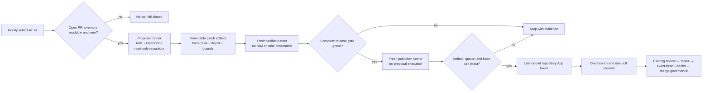

# Hourly NVIDIA NIM Product Development Design

## Status and scope

This design is approved for autonomous execution by the standing repository-development mandate. It adds a second hourly workflow for bounded product proposals while preserving the existing deterministic minute-17 quality sentinel. The workflow creates no direct release, deployment, approval, or merge authority.

## Product problem

Four Pillars already verifies release quality every hour, but an empty PR and issue queue produces no new buyer-visible improvement. A commercial buyer therefore sees a mature verification loop without a corresponding safe mechanism that converts idle capacity into one reviewable product increment. The missing capability is an hourly, pull-request-first OpenCode loop that uses the dedicated NVIDIA NIM secret, remains independently operable, and hands every decision back to existing exact-head review governance.

## Design goals

1. Run once per hour at minute 47, separate from the deterministic minute-17 sentinel.
2. Invoke OpenCode only when open-PR inventory is readable and the count is zero.
3. Use `NVIDIA_NIM_API_KEY` for model inference and never use `COPILOT_GITHUB_TOKEN`.
4. Produce at most one bounded pull request; never merge, approve, release, deploy, or weaken repository rules.
5. Preserve standalone operation and modular MSA integration with central `.github`, `naruon`, Contextual Orchestrator, and other services.
6. Keep model execution, verification, and write credentials on three different ephemeral runners.
7. Require realistic tests, complete production statement and branch coverage, complete public docstrings, APA 7 doctoring, descriptive database names, affected architecture and operations documentation, and `CHANGELOG.md`.
8. Allocate test-time compute according to task complexity using Fugu-style routing, TRINITY roles, and Conductor workflow/access-list concepts. Speed is not a priority.

## Non-goals

- Replacing the existing CodeRabbit, OpenCode review, security, or release workflows.
- Giving the coding model a GitHub token, App token, OIDC token, artifact runtime token, or merge authority.
- Automatically treating model output as trusted source code or evidence.
- Adding a product-runtime LLM dependency to deterministic calendrical calculations.
- Publishing a new package version for workflow-only governance.

## Architecture

### Proposal runner

The proposal runner receives repository read permission, pull-request read permission, and `NVIDIA_NIM_API_KEY`. It checks the queue before checkout, installs a checksum-pinned OpenCode archive, and runs one bounded model candidate at a time. The model subprocess has GitHub, OIDC, artifact/cache runtime, and runner command-file channels removed. Network tools, Git remote mutation, Git commits, Git pushes, `gh`, MCP, web access, external-directory access, task delegation, and interactive questions are denied.

The prompt requires one buyer-visible gap, test-first evidence, realistic product tests, all documentation and standards work, modular boundaries, complete coverage/docstrings, and a bounded `PR_MESSAGE.md`. It explicitly asks the agent to choose a single-model route for simple tasks or a deeper conducted workflow when decomposition, independent work, verification, or synthesis is required. Role-specific reasoning effort, workflow depth, access lists, and fixed-mode ablation are required when a product-runtime LLM path changes.

After OpenCode finishes, the trusted step runs the repository's complete release gate, stages every proposal file, rejects whitespace errors, symlinks, gitlinks, oversized file counts, and oversized patches, then uploads a one-day immutable artifact. The handoff records the exact base SHA, patch SHA-256, file count, byte count, artifact ID, and artifact digest.

### Verification runner

A second fresh runner checks out the exact base SHA and downloads the artifact by numeric ID. It validates the artifact's deterministic name, workflow-run identity, expiry state, digest, patch digest, patch size, file count, base SHA, and forbidden Git modes. It applies the patch and runs every release-quality gate without model, publication, OIDC, artifact/cache runtime, or command-file credentials. Verification must not change tracked or non-ignored untracked files. The staged patch digest and size must remain identical after testing.

### Publication runner

A third fresh runner checks out the exact base and copies the trusted PR metadata parser into `RUNNER_TEMP` before applying the untrusted patch. It downloads and independently revalidates the same artifact, applies it only as Git data, and never installs dependencies or executes proposed code. The trusted parser opens `PR_MESSAGE.md` without following symlinks, requires a stable regular file, decodes strict UTF-8, rejects control and bidirectional spoofing characters, enforces byte budgets, and writes owner-only title/body files.

Only after validation does the publisher mint a repository-scoped Maintainer App token. It rechecks the open PR inventory and live default-branch SHA, creates a unique branch, commits with hooks disabled, pushes once, and calls `gh pr create` exactly once. A failed PR creation deletes the orphan branch.

## OpenCode version policy

The latest official OpenCode release reviewed during design was `v1.18.13`. The workflow deliberately retains the previously verified `v1.17.13` Linux x64 archive and known SHA-256 until the newer archive digest is independently captured and tested in a separate dependency update. A moving `latest` download is prohibited.

## Research-grounded orchestration policy

The scheduled coding prompt maps research concepts to repository controls without claiming that this workflow implements the papers' learned coordinators:

- **Fugu:** route simple tasks to one model and reserve deeper workflows for work that benefits from composition.
- **TRINITY:** distinguish thinker, worker, verifier, and synthesizer responsibilities rather than asking one undifferentiated role to do everything.
- **Conductor:** represent work as bounded natural-language subtasks with explicit access lists, so each role receives only required prior outputs.
- **Ablation:** when runtime orchestration changes, compare forced low-depth and deep modes on the same fixtures and report quality/cost evidence. Latency is recorded but is not the optimization target.

The repository continues to use deterministic calculations as immutable evidence. Models may propose implementation or interpretation changes but cannot alter calculated pillars, boundaries, or fingerprints without deterministic tests and review.

## Error handling

Every uncertainty fails closed:

- unreadable PR inventory: no model call;
- open PR: no model call;
- absent NIM or publication configuration: documented no-op;
- model timeout or all-candidate failure: no artifact;
- cleanup failure between candidates: stop;
- malformed or oversized proposal: reject;
- artifact identity mismatch: reject;
- verification failure or mutation: reject;
- changed main branch or new PR after generation: reject;
- publication failure: remove the orphan branch.

No failure path falls back to Copilot, another credential, a write-capable job token, or administrative merge.

## Testing strategy

The first commit adds a failing contract test covering the schedule, credential boundary, three-runner isolation, artifact binding, environment removal, full release gate, research prompt, documentation, and parser behavior. Implementation then makes that contract green. Existing CI repeats all offline tests on Python 3.11 and 3.12 with exactly 100 percent production statement and branch coverage, builds distributions and the pinned container, and runs Security Scan and Semgrep.

## Documentation and governance

- `AGENTS.md` records agent authority and exact-head handoff.
- `CLAUDE.md` gives coding agents a concise repository contract.
- `ARCHITECTURE.md` explains standalone/MSA boundaries and includes the control-plane diagram.
- The operations runbook documents schedule, enablement, credentials, evidence, failures, disablement, and rollback.
- Doctoring distinguishes primary-source facts, repository decisions, assumptions, and residual risks and records APA 7 references.
- `CHANGELOG.md` records the unreleased workflow without changing v0.7.0.
- The product-gap audit verifies that the workflow and documentation cannot silently disappear.

## Security assumptions and residual risks

The NIM secret necessarily exists in the OpenCode process. Repository source may be sent to NVIDIA and requires operator review of confidentiality, retention, region, and contract terms. The verifier executes untrusted proposed code on an ephemeral hosted runner with outbound network access but receives no publication credential. GitHub-hosted runners, artifact storage, pinned actions, and the repository-scoped App remain trusted dependencies. Exact IDs and digests detect exposed mismatch but do not prove semantic correctness. A future inference broker and reusable central workflow can narrow these risks provided they preserve this three-runner boundary.
