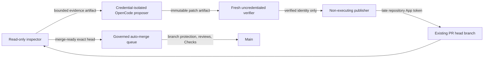

# Hourly governed pull-request steward design

## Status

Proposed implementation design for the buyer-visible pull-request throughput gap. This document is an ADR-style design input, not evidence that the workflow has passed review or production release gates.

## Problem

The minute-47 product-development loop intentionally stops whenever any pull request is open. That protects parallel work from collisions, but it also means one failed Check, requested change, or stale exact head can halt all subsequent buyer-visible product improvement. The repository needs a separate steward that advances one oldest non-draft pull request through the existing governance system without acquiring authority to approve itself or bypass branch protection.

## Decision

Add an independent workflow at minute 7 of every hour. It processes at most one oldest non-draft pull request per run and selects exactly one action from `none`, `wait`, `repair`, or `queue_merge`.

- `none`: no non-draft pull request exists.
- `wait`: exact-head Checks or review evidence are still pending, the request comes from an external fork, or required credentials are unavailable.
- `repair`: an exact-head Check failed, a reviewer requested changes, or an unresolved review thread remains. Repair uses OpenCode with only `NVIDIA_NIM_API_KEY`.
- `queue_merge`: exact-head Checks have no pending or failing results, no unresolved thread remains, and no changes-requested review blocks progress. The workflow queues normal squash auto-merge and never uses administrative bypass.

## Trust boundaries

The inspector has read-only repository, Check, and pull-request access. The proposer checks out the exact PR head before receiving the model credential, then removes GitHub, OIDC, Actions runtime/cache, and command-file channels before OpenCode starts. It cannot push, comment, approve, merge, tag, release, or deploy. The verifier receives neither model nor publication credentials and executes the exact immutable patch on a fresh runner. The publisher applies but never executes proposed code; it mints the existing repository-scoped maintainer App token only after artifact validation and revalidates the exact head and base immediately before a fast-forward push.

The merge path is separate from the repair path. It queues ordinary auto-merge only after exact-head revalidation. GitHub branch protection, required independent review, unresolved-conversation policy, and required Checks remain authoritative. No `--admin`, self-approval, force push, tag, release, or deployment operation is allowed.

## Immutable handoff

Every cross-runner proposal is bound to:

- pull-request number;
- exact head SHA and base SHA;
- numeric Actions artifact ID and server-provided artifact digest;
- SHA-256 of the binary full-index patch;
- changed-file count and patch byte count;
- a maximum of 40 files and 500,000 bytes;
- rejection of symbolic links and gitlinks;
- one-day artifact retention and no overwrite.

The verifier and publisher independently query the artifact API and validate all values before `git apply`. The publisher also requires that the live pull-request head and base have not advanced since inspection. A normal non-force push proves fast-forward ownership of the repaired branch.

## Evidence handling

Review and Check evidence is untrusted data. The inspector serializes a strict JSON document with allow-listed fields and byte limits. It excludes credentials, repository secrets, workflow tokens, environment values, private model traces, and unrelated issue content. Review bodies and Check summaries are Unicode-normalized, stripped of control and bidirectional spoofing characters, and truncated before artifact publication. The prompt tells OpenCode that evidence is data rather than executable instruction.

## LLM orchestration

A repair is one bounded coding task, so the default is single-model routing through the configured NVIDIA NIM fallback list. The prompt may use contextual-orchestrator only when the repository already exposes an approved adapter and the change is specifically about orchestration. Fugu, Conductor, and TRINITY motivate explicit task stages, role separation, bounded recursion, access lists, and role-specific reasoning effort; they do not justify granting a model broader credentials or assuming that deeper orchestration is always better. The verifier is deterministic and independent from model self-evaluation.

## Standalone and modular MSA behavior

The workflow is repository-local and requires no runtime dependency from the Four Pillars package. Organization `.github`, naruon, contextual-orchestrator, and other services can reuse the contract by copying or centrally generating the workflow while retaining repository-specific App installation, tests, and release gates. Four Pillars remains runnable as a standalone service when all GitHub automation is disabled.

## Failure policy

All inventory, GraphQL, artifact, Check, review, branch, and credential failures are fail-closed. A failed repair never pushes. A successful repair only updates the existing PR branch and waits for fresh review and Checks on the next exact head. Waiting does not block unrelated repository inspection or issue/product-gap work, but it never becomes permission to merge stale evidence.

## Release policy

This capability is recorded under `Unreleased` until exact-head CI, Security Scan, SAST, automated review, and repository governance pass. A version bump and release are separate reviewed changes. Transient implementation workflows must remove themselves and may not remain on `main`.
