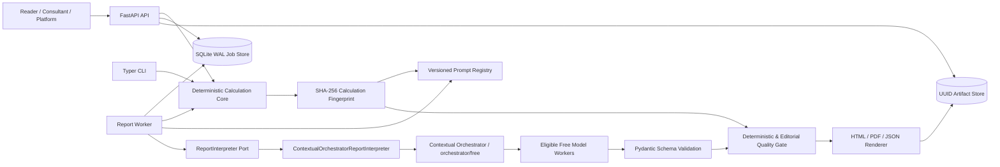
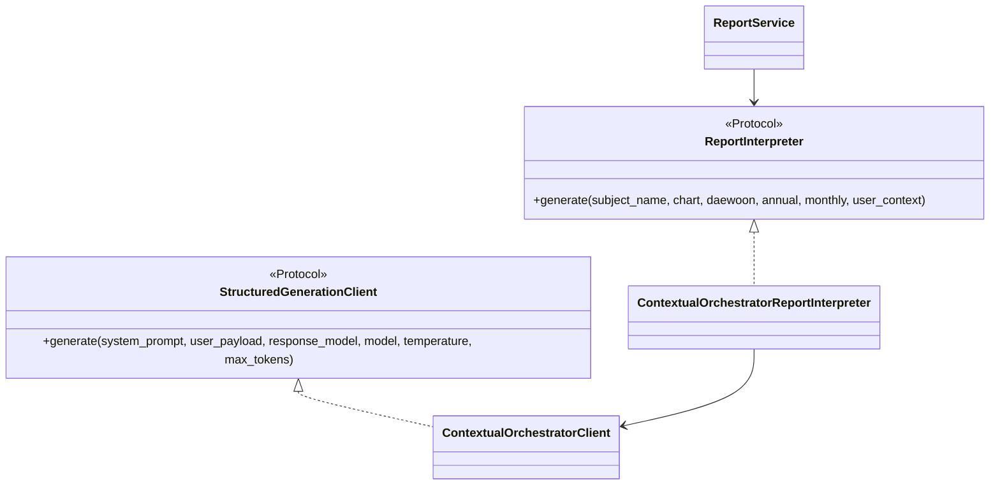
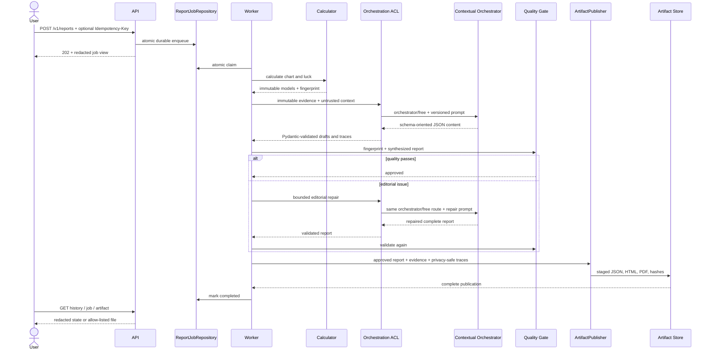
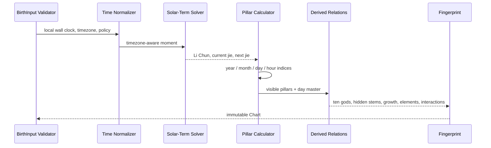
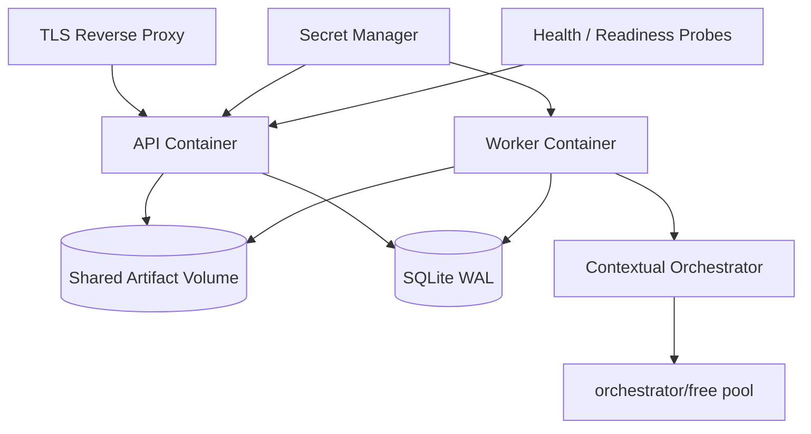
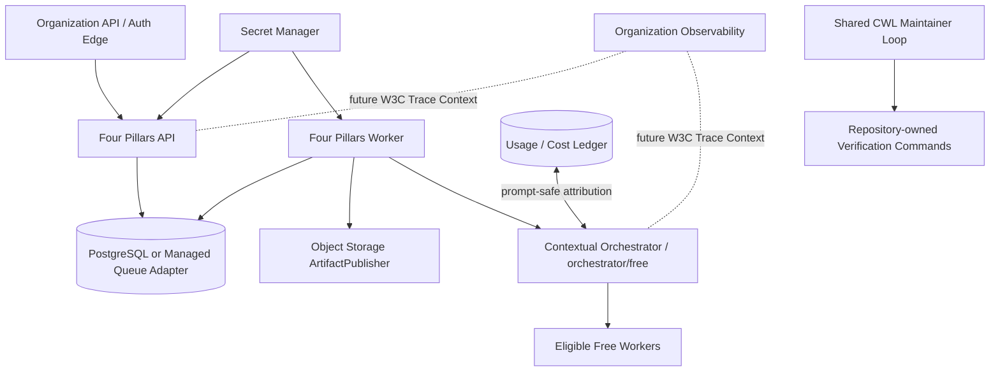
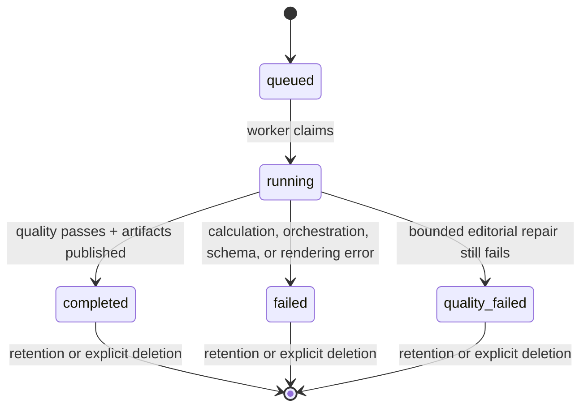

# Architecture and UML

## Component view

The calculator does not depend on interpretation, rendering, HTTP, or the queue. `ReportService` composes structural ports. The repository-owned interpretation path is an anti-corruption layer into Contextual Orchestrator and fixes its virtual model to `orchestrator/free`. Provider discovery, provider credentials, and free-pool failover remain outside Four Pillars. Calculations remain available during orchestration outages, and custom queue, interpreter, or artifact implementations can be injected without rewriting calendar rules.

## Interpretation adapter class view

Provider-specific compatibility transport remains transitional test infrastructure and is deliberately omitted from the product class view. ADR 0004 records its later move into a provider-neutral `infrastructure/orchestration` namespace.

## Report sequence

The virtual route never changes during one job. Missing gateway credentials, an empty free pool, invalid responses, and exhausted retry or repair budgets become visible failures rather than direct-provider fallback.

## Calculation sequence

## Single-node product view

SQLite and a shared filesystem intentionally define the single-node data plane. LLM-backed reports still use the organization orchestration boundary; standalone refers to application deployment, not provider routing ownership.

## Organization MSA deployment view

Four Pillars uses a gateway-specific token and may inject remote repository and artifact adapters. `service=four-pillars` and optional account/team/group/company labels support usage attribution; subject data, prompts, outputs, fingerprints, paths, and credentials are excluded.

Current generation traces are local evidence, not W3C distributed traces. `traceparent`/`tracestate` propagation and RFC 9457 problem responses remain separately versioned changes.

## State machine

## Standards traceability

`docs/standards/REFERENCES.md` records APA 7th references for ISO/IEC 25010:2023, ISO/IEC 42001:2023, ISO/IEC 23894:2023, NIST AI RMF, NIST AI 600-1, RFC 9457, W3C Trace Context, and peer-reviewed LLM-judge research. `docs/standards/TRACEABILITY.md` maps architecture elements to controls, tests, workflows, limitations, and future work. The mapping is not an ISO certification or scientific validation of traditional interpretation.
