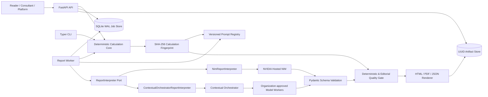
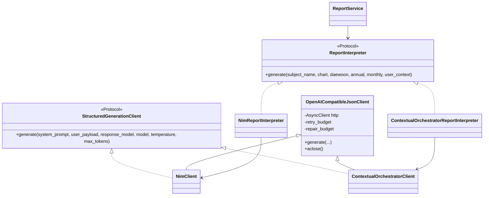
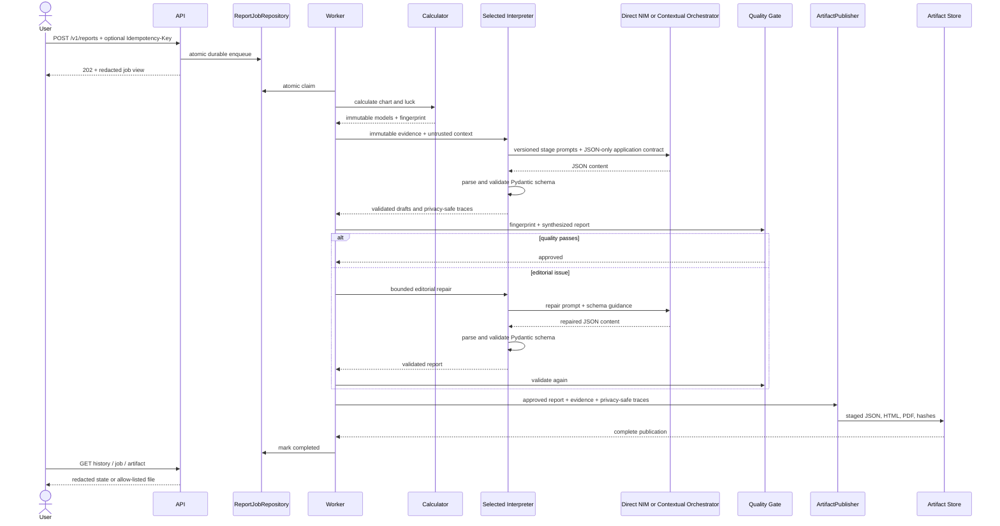
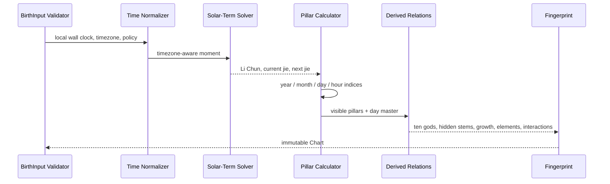
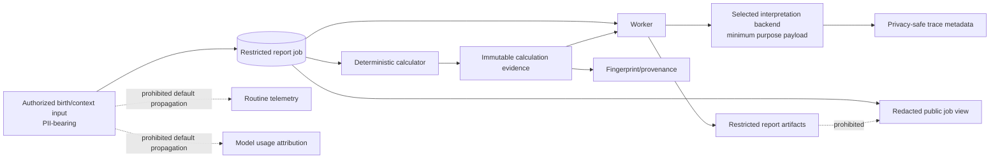
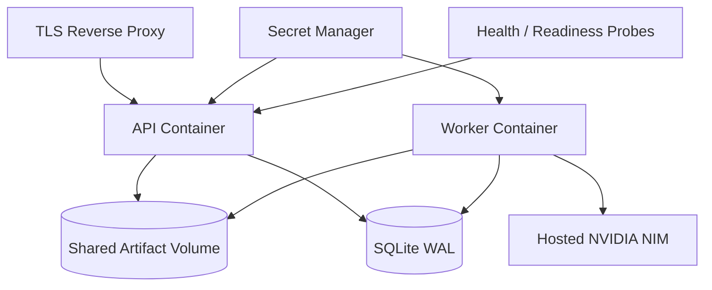
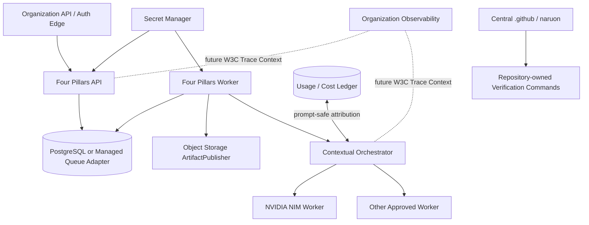
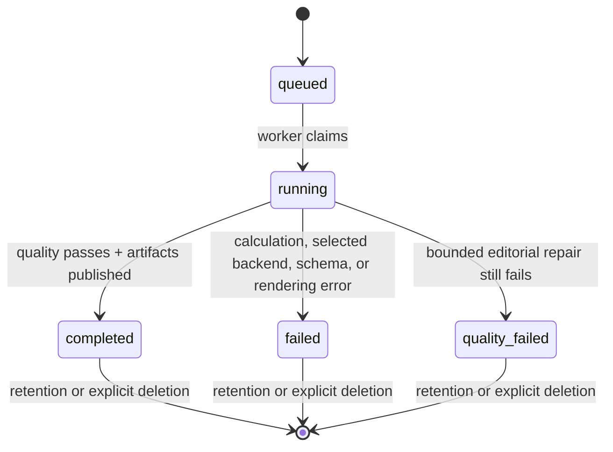

# Architecture and UML

This file describes the protected-main runtime architecture. Repository automation authority is modeled separately in `docs/uml/control-plane.md`, and persistence/data authority is modeled in `docs/erd/domain-model.md`. Those separate viewpoints prevent runtime, automation, persistence and governance concerns from being collapsed into one diagram.

## Component view

The calculator does not depend on interpretation, rendering, HTTP, or the queue. `ReportService` composes structural ports. Direct NVIDIA NIM is the standalone default; Contextual Orchestrator is optional and selected explicitly. The worker is the only built-in component that combines calculation, interpretation, validation, and publication. Calculations remain available during model-provider outages, and custom queue, interpreter, or artifact implementations can be injected without rewriting calendar rules.

## Interpretation adapter class view

`NimTrace` remains the compatible application trace model for model identity, attempts, repairs, and raw validation content. Public trace artifacts expose only privacy-safe fields assembled by `analysis.py`. The orchestrator receives organization attribution separately; personal data and generated content are prohibited from attribution.

The two adapters do not use identical provider-native response semantics. Direct NVIDIA NIM may use its native JSON mode. `ContextualOrchestratorClient` currently sets `native_json_mode=False`, requires JSON through the application prompt, and keeps Pydantic parsing/validation plus bounded repair in Four Pillars. This distinction is intentional and must remain aligned with production code.

## Report sequence

The selected interpreter never changes during one job. Missing credentials, unavailable gateways, invalid responses, and exhausted retry or repair budgets become visible failures rather than provider fallback. The sequence deliberately says “JSON-only application contract”: it does not claim that Contextual Orchestrator receives provider-native `response_format`.

## Calculation sequence

The current calculation evidence version is `calendar-1.1.0`. Boundary-critical modern roots are checked offline against committed KASI 2026 evidence independently corroborated by NAOJ minute values.

## Personal-data authority view

Purpose-required personal values remain usable inside the authorized calculation/report path. Privacy is enforced by authorization, minimum boundary payloads, opaque identifiers, encryption/secret controls, retention/deletion/export and restricted privileged access rather than blanket masking.

## Standalone deployment view

SQLite and a shared filesystem intentionally define the single-node edition. `INTERPRETATION_BACKEND=nvidia_nim` and `NVIDIA_NIM_API_KEY` provide the independent default.

## Organization MSA deployment view

The organization form selects `INTERPRETATION_BACKEND=contextual_orchestrator`, uses a gateway-specific token, and may inject remote repository and artifact adapters. Four Pillars does not install or import gateway internals. `service=four-pillars` and optional account/team/group/company labels support usage attribution; subject data, prompts, outputs, fingerprints, paths, and credentials are excluded.

Current generation traces are local evidence, not W3C distributed traces. `traceparent`/`tracestate` propagation and RFC 9457 problem responses are documented future changes that require separate compatibility PRs.

No arrow in the MSA view means direct cross-service application-database access. Each product owns its persistence and integrates through versioned APIs/events/ports/artifacts.

## State machine

The physical and conceptual data entities behind this lifecycle are defined in `docs/erd/domain-model.md`.

## Repository control-plane view

The implemented minute-17 deterministic quality sentinel and minute-47 NVIDIA/OpenCode product-development workflow, plus the currently Proposed minute-07 PR steward, require a separate authority-focused viewpoint. See `docs/uml/control-plane.md`. That document distinguishes model proposal, uncredentialed verification, late publication, independent review, merge and release authority rather than representing “automation” as one trusted actor.

## Standards traceability

`docs/standards/REFERENCES.md` records APA 7th references for ISO/IEC 25010:2023, ISO/IEC 42001:2023, ISO/IEC 23894:2023, ISO/IEC/IEEE 42010:2022, ISO/IEC/IEEE 29148:2018, OMG UML 2.5.1, information-security/privacy standards, CSAP/SOC 2 readiness sources, NIST AI/security frameworks, RFC 9457, W3C Trace Context, astronomical evidence, and peer-reviewed LLM-judge research. `docs/standards/TRACEABILITY.md` maps architecture elements to controls, tests, workflows, limitations, and future work. The mapping is not an ISO/CSAP/SOC 2 certification or scientific validation of traditional interpretation.
