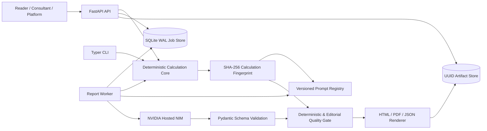
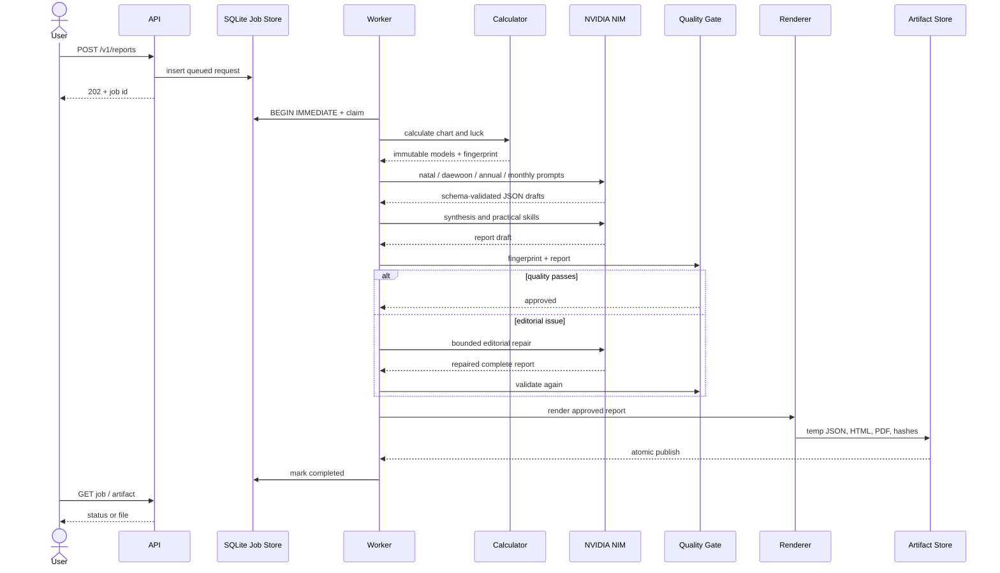
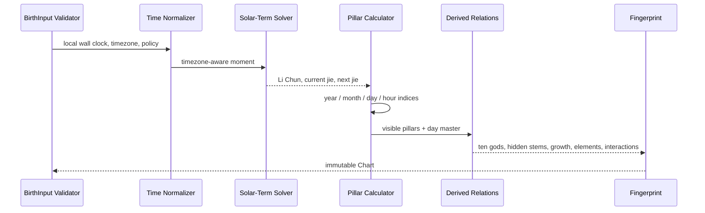
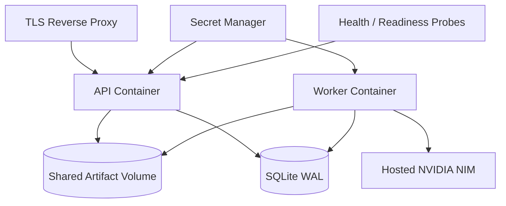
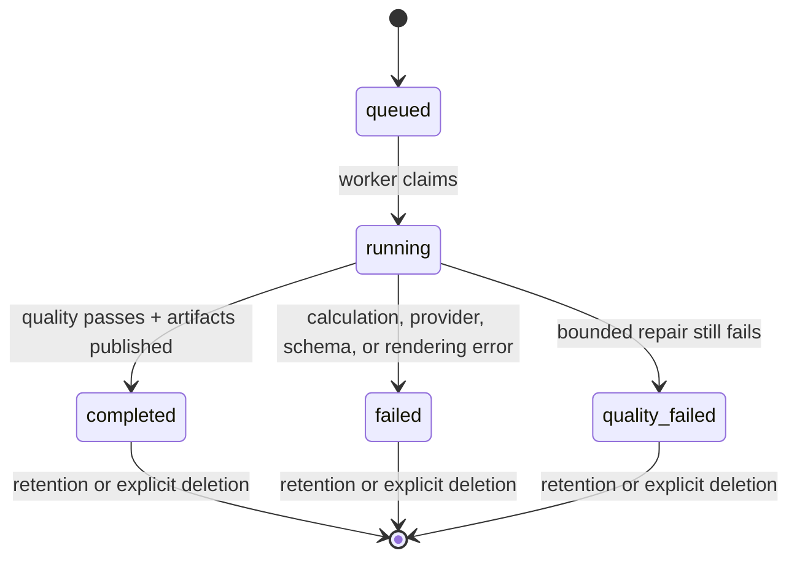

# Architecture and UML

## Component view

The calculator does not depend on NIM, rendering, HTTP, or the queue. The worker is the only component that combines those boundaries. This makes calculations available during provider outages and allows NIM, storage, or queue implementations to change without rewriting calendar rules.

## Report sequence

## Calculation sequence

## Deployment view

SQLite and a shared filesystem intentionally define the single-node edition. A horizontally scaled edition replaces `JobStore` and the artifact adapter while keeping calculation, NIM, quality, and report interfaces stable.

## State machine

