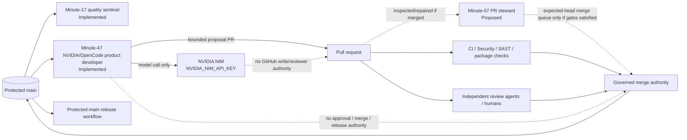
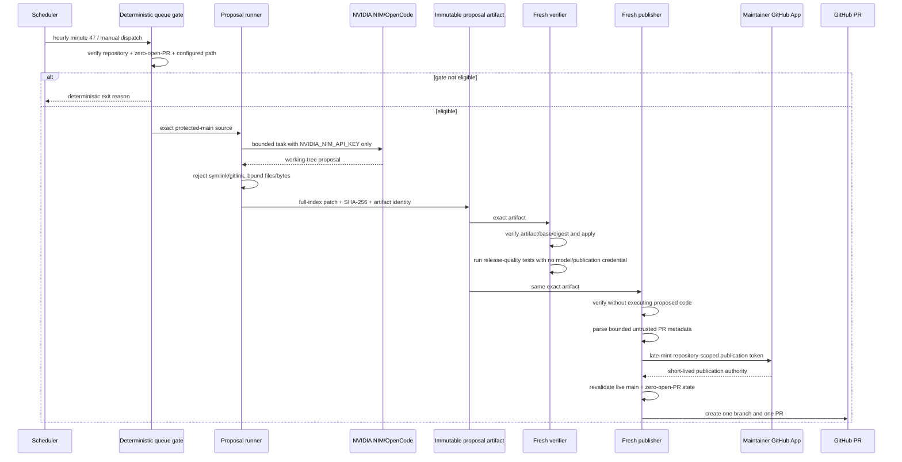
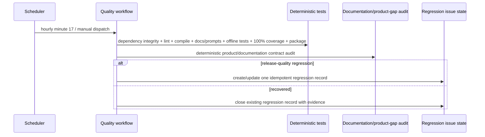
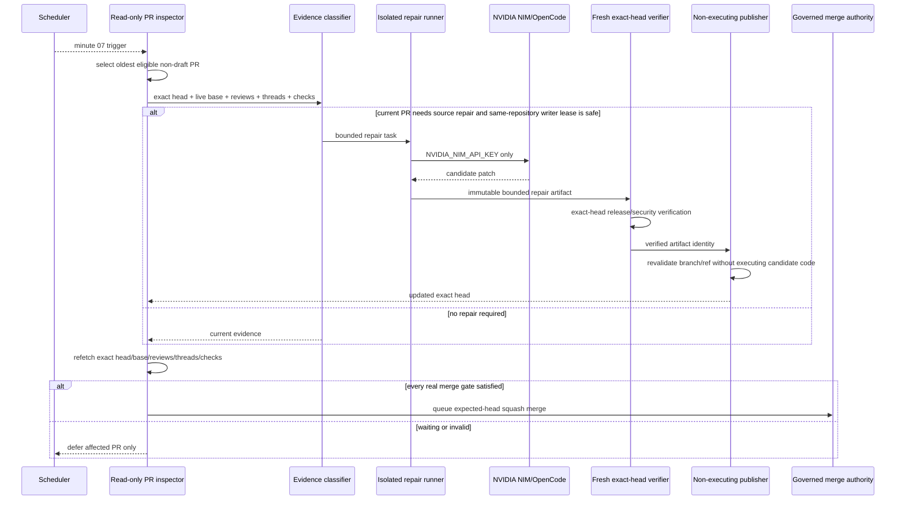
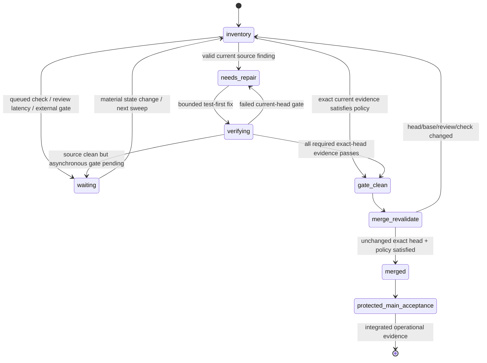
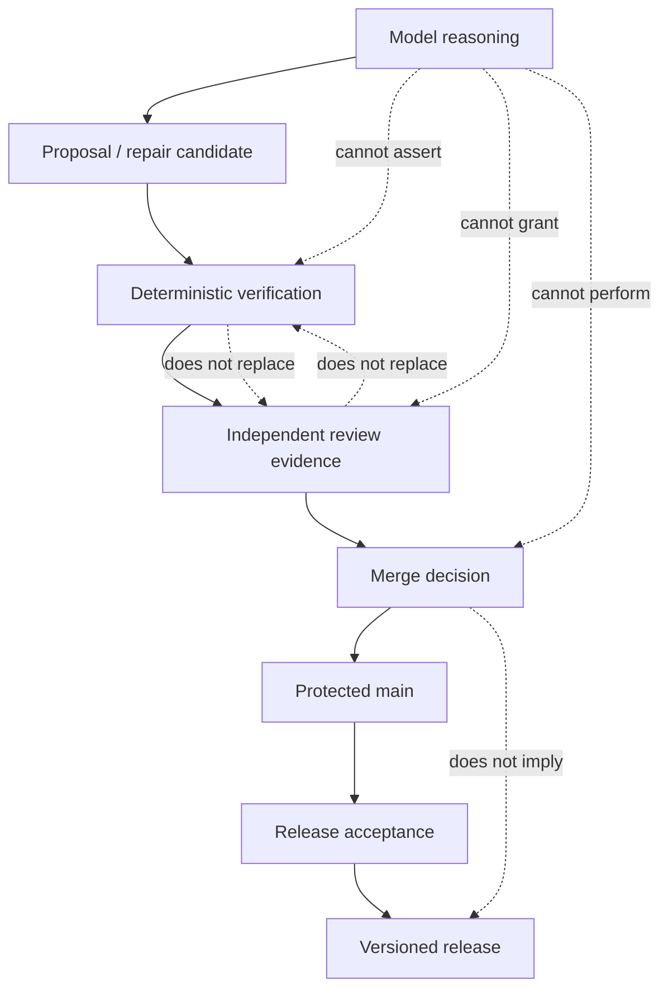
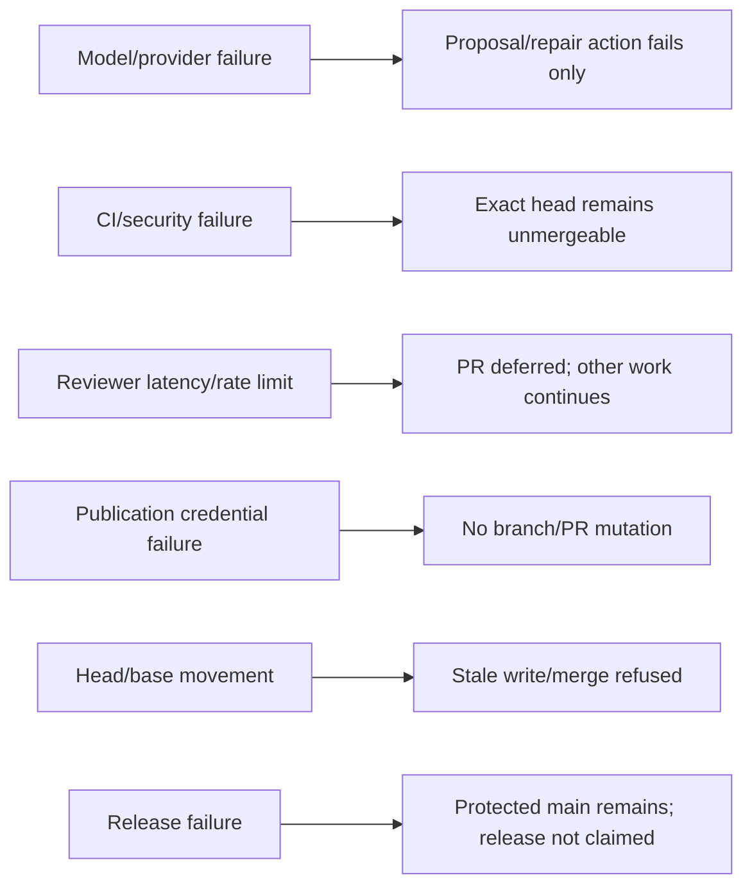

# Four Pillars Repository Control-Plane Diagrams

This file complements `docs/uml/architecture.md` with repository-development and governance views. Implemented and Proposed zones are deliberately separated so an unmerged workflow is never presented as protected-main behavior.

Notation uses Mermaid in a UML-like manner. OMG UML 2.5.1 is the notation reference; ISO/IEC/IEEE 42010:2022 informs the separation of viewpoints and stakeholder concerns.

## Control-plane component view

`Steward` remains Proposed until its feature PR reaches protected main.

## Minute-47 product-development sequence — Implemented

The model path does not receive reviewer, merge or release authority. Publication credentials exist only after proposal verification.

## Minute-17 quality sentinel — Implemented

The sentinel is intentionally model-free and receives no NIM credential.

## Minute-07 PR steward — Proposed

This diagram describes the intended accepted architecture of PR #29 but remains Proposed until that implementation merges.

## Evidence and merge state machine

`waiting` is not a repository-wide blocker and never authorizes a bypass.

## Authority separation

No green check, LLM verdict, comment, status, or synthetic merge commit collapses these authorities into one signal.

## Failure-domain view

## References

International Organization for Standardization, International Electrotechnical Commission, & Institute of Electrical and Electronics Engineers. (2022). *Software, systems and enterprise—Architecture description* (ISO/IEC/IEEE Standard No. 42010:2022). https://www.iso.org/standard/74393.html

Object Management Group. (2017). *OMG Unified Modeling Language (OMG UML), version 2.5.1*. https://www.omg.org/spec/UML/2.5.1
