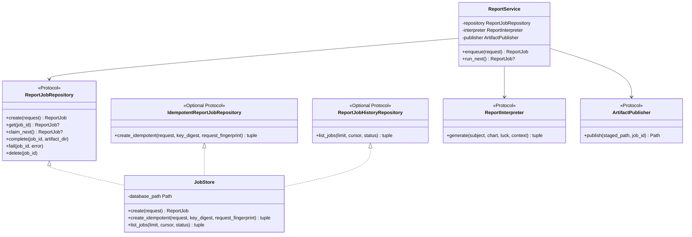
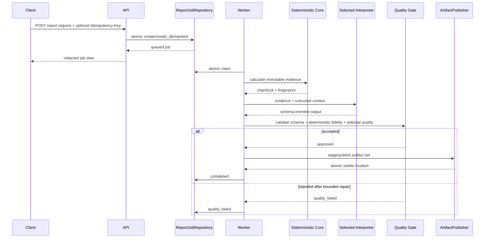
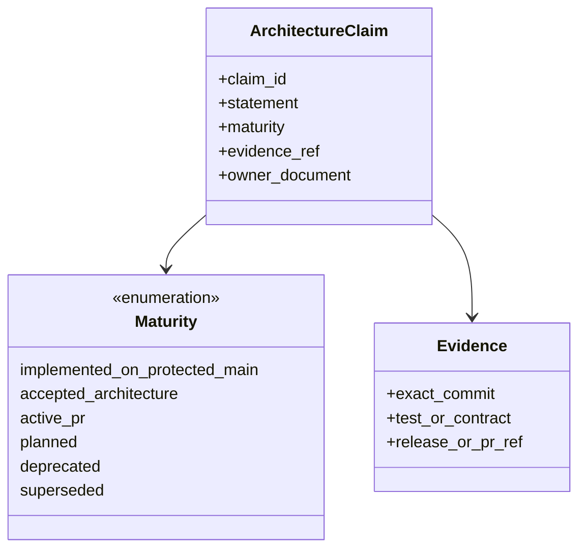

# Governance and Persistence UML Views

These views complement `docs/uml/architecture.md`. They focus on durable application boundaries and autonomous-development authority that were previously scattered across PR bodies and operations documents.

## Persistence port class view

The optional protocols prevent one new API surface such as history or idempotency from breaking every existing MSA repository adapter.

## Job and artifact sequence

## Autonomous-development authority state view

```mermaid
stateDiagram-v2
    [*] --> Inventory
    Inventory --> SelectBoundedWork: executable item exists
    SelectBoundedWork --> RED: source/behavior defect
    SelectBoundedWork --> DocumentationImpact: architecture/documentation defect
    RED --> Implement
    DocumentationImpact --> Implement
    Implement --> Verify
    Verify --> Repair: valid failure/finding
    Repair --> Verify
    Verify --> ReviewReady: exact bounded increment green
    ReviewReady --> IndependentGovernance
    IndependentGovernance --> ProtectedMain: required reviews/checks/branch policy pass
    IndependentGovernance --> Deferred: check/review/provider wait
    Deferred --> Inventory: rotate; waiting is local
    ProtectedMain --> OperationalProof: changed control/release path requires runtime evidence
    OperationalProof --> Inventory: continue queue
```

The minute-47 product-development workflow may reach `ReviewReady` by proposing one bounded PR but does not own the `IndependentGovernance -> ProtectedMain` transition. PR #29 proposes a steward for governed PR triage/merge queueing and remains `active_pr` until protected-main integration.

## Documentation maturity class view

This is a documentation model, not a runtime database schema. It prevents a mutable PR body or plan from being treated as evidence that a capability already exists on protected main.
